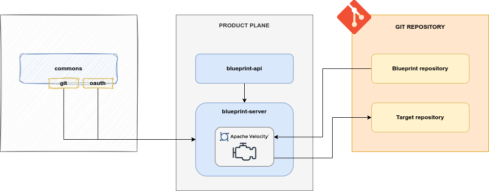

# Blueprint

## Description

Blueprint is a module of the Product Plane of the ODM Platform. 
It's an independent module that allows users to initialize a new Git-based project starting from a base template, 
that is the **blueprint**, and a series of parameters.

At the state of the art, Blueprint supports 2 main Git Provider:
* Azure DevOps
* GitHub

A basic description and a how-to guide for execution is available on the module [README.md](https://github.com/opendatamesh-initiative/odm-platform/blob/main/product-plane-services/blueprint-server/README.md) on GitHub.

## Technologies

* Java 11
* Maven 3.8.6
* Spring 5.3.28
* Spring Boot 2.7.13
* Git
* OAuth 2
* [Apache Velocity 2.2](https://velocity.apache.org/)

### Git
Input templates and output projects are both meant to be remote Git repository. 
The project will fetch information from the source remote repository, templates them with a series of parameters
given by the user, and push the resulting project on a new or already existing remote Git repository.

Git authorization could be handled in two different ways:

1. SSH: if the instance of Blueprint has the SSH key to interact with the desired Git repositories and if the Blueprint remote repository URI is an SSH URI, SSH will be the default protocol
2. OAuth2: if the Blueprint remote repository URI is an HTTPS URI, OAuth2 will be used to fetch an _Access Token_

### OAuth2
[OAuth 2.0](https://oauth.net/2/) is the _authorization_ protocol used for interactions with Git providers, 
such as Azure DevOps.

On start-up, Blueprint Server must be configured through the _property files_ with OAuth parameters like:

* Token URI
* Client ID
* Client Secret
* Scope

*_Actually, OAuth is implemented only for Azure DevOps; GitHub interactions are modeled with a single PAT 
(i.e., Personal Access Token). In the future, when also different providers are supported, 
OAuth will be the default authorization protocol for any Git provider_

### Apache Velocity
[Apache Velocity](https://velocity.apache.org/) is a Java-based template engine that permits anyone to use 
a simple yet powerful template language to reference objects. 

Even if it is mainly used for web development, Velocity's capabilities reach well beyond the realm of the web;
for example, it can be used to generate SQL, PostScript, XML, JSON, ... from templates.

In the Blueprint Server service it represents the only supported template engine and will be directly used to resolve
any user template.
The project doesn't override any native features, so check out Apache Velocity documentation for any specific information 
about syntax and templating.

## Blueprint concept
A blueprint in ODM, is a template with the following structure:
```txt
| repository/
|-- blueprintDirectory/
|---- blueprint content ...
|-- other content ...
|-- params.json
```
where:

* `blueprintDirectory` is a root-level directory containing the real blueprint/template
  
    * it will be the only content of the target repository when instanciating a blueprint
    * it could have a different name

* Other content will be ignored and won't be templated
* `params.json` is a JSON file describing the parameters of the template with the following structure:
```json
[
   {
     "name": "parameterName",
     "description": "Parameter description",
     "defaultValue": "Parameter default value"
   }, 
   {
     ...
   },
   ...
]
```

Both directory/file names and file contents could be templated, each parameter of the blueprint must have the following naming convention: `${parameterName}`. 
The variable name can't also contain special characters such as `",",".","-","_", ...`

For example, given the parameters `dirName=renamedDirectory`, `fileName=renamedFile` and `fileContent=test`, and the following blueprint:
```txt
| repository/
|-- blueprint/
|---- ${dirName}/
|------ ${fileName}.json 
```
where `${fileName}.json` content is:
```txt
{
    "content": "${fileContent}"
}
```
the target repository will be:
```txt
| targetRepository/
|-- renamedDirectory/
|---- renamedFile.json
```
where `renamedFile.json` content will be:
```txt
{
    "content": "test"
}
```

In addition to variables expressed as `${var}`, it supports any other native [Velocity Template Language](https://velocity.apache.org/engine/devel/user-guide.html#velocity-template-language-vtl-an-introduction) syntax

## Architecture
As the majority of the ODM services, the Blueprint Service is composed by:

* Blueprint API module: a module containing abstract controller, resource definition and a client to interact with the controller
* Blueprint Server module: a module implementing the abstract controller, any other component to interact with the DB, and any service needed for the templating operations



## Relationships
Blueprint service, as described in the introduction, doesn't require any other ODM module,
and it doesn't directly interact with any of them.
It's a stand-alone project that exposes features to register, manage and initialize templates.

Nonetheless, even if its scope could be much wider,
it's meant to be used in the ODM world to initialize both full projects 
and JSON descriptors of ODM objects such as Data Product.