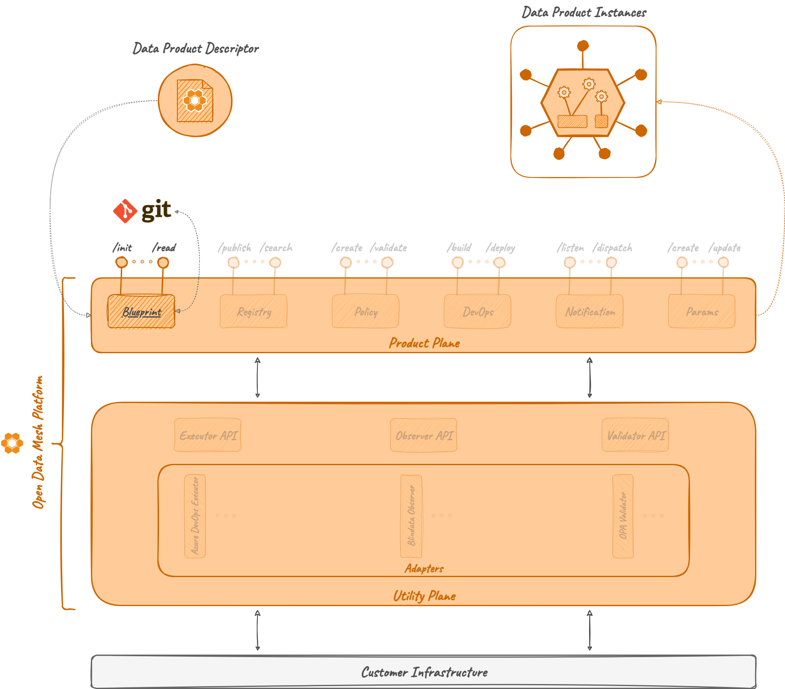

# Blueprint

## Overview

The *Blueprint Microservice* is a module of the Product Plane in the ODM Platform which allows to initialize a data product starting from a template. This module works independently from the others.

Essentially, given a template repository on a Git provider with some of the file contents parameterized, the module is able to clone it, map the user's input data to parameters, and push the content to a brand new repository (i.e. creating a new data quantum).

At the state of the art, Blueprint supports two main Git Providers:

* Azure DevOps
* GitHub

## Concepts

### Blueprint

In ODM terminology, a **blueprint** is a Git repository containing the template composition of a data product. Each blueprint must contain two elements:

- A **data product template**: a set of folders and files, properly configured and parameterized, to allow the Blueprint Microservice to perform the appropriate parameter substitutions and value assignments.
- A **parameters configuration**: a configuration file specifying all the parameters to be substituted in the blueprint.

## How it works

### Architecture

As the majority of the ODM services, the Blueprint Microservice is composed by two modules:

* **Blueprint API**: a module containing abstract controllers, Java resource definitions, and a client to interact with the controller.
* **Blueprint Server**: a module implementing the abstract controllers, any component useful to interact with the DB (entities, mappers, repositories, ...), and services needed for the templating operations.



### Relations

Blueprint Microservice, as described in the introduction, doesn't require any other ODM module to work, and it doesn't directly interact with any of them. It's a stand-alone module that exposes features to register, manage and initialize templates.

Nonetheless, even if its scope could be much wider, it's meant to be used in the ODM platform to initialize data product descriptors and data product components.

### Tools

#### Git

Input templates and output projects are both meant to be remote Git repositories.  Git integration is used to fetch information from the source remote repository and to push the resulting project on a new (or already existing) remote Git repository.

Git authorization could be handled in two different ways:

1. SSH: you can configure the instance of Blueprint to have an SSH key to interact with the desired Git repository.
2. OAuth 2.0: you can configure the instance of Blueprint to access the remote repository via HTTPS using OAuth2 protocol for authorization using an _Access Token_.

#### OAuth 2.0

OAuth 2.0 is the _authorization_ protocol we chose to interact with Git providers. During the start-up phase, Blueprint Server must be configured through the _property files_ to specify the typical OAuth parameters:

* Token URI (i.e. the identity provider URI to get the authorization token)
* Client ID
* Client Secret
* Scope

!!! note
    
    Actually, OAuth 2.0 is implemented only for Azure DevOps. GitHub interactions are modeled with a single PAT (i.e., Personal Access Token).
    
    In the future, when different Git providers will be supported, OAuth2 will be the default authorization protocol for any of them.

#### Apache Velocity

Apache Velocity is a Java-based template engine that permits anyone to use a simple yet powerful template language to reference objects.

Even if it is mainly used for web development, Velocity's capabilities reach well beyond the realm of the web; for example, it can be used to generate SQL, PostScript, XML, JSON, from templates.

Apache Velocity is the template engine we chose to resolve any user template on starting from the data product blueprint. Our project doesn't override any native feature, so check out Apache Velocity documentation for any specific information about its syntax and its templating capabilities.

## Examples

In the ODM framework, a blueprint must have the following structure:
```txt
| repository/
|-- blueprintDirectory/
|---- blueprint content ...
|-- other content ...
|-- params.json
```
where:

* `blueprintDirectory` is a root-level directory containing the real template
  
    * it will be the only content of the target repository when instantiating a blueprint
    * it could have a different name

* `Other content` will be ignored and won't be templated
* `params.json` is a JSON file describing the parameters of the template with the following structure:
```json
[
   {
     "name": "parameterName",
     "description": "Parameter description",
     "defaultValue": "Parameter default value"
   }, 
   {
     ...
   },
   ...
]
```

File contents, file names, and directory names can all be templated. Each parameter of the blueprint must have the following naming convention: `${parameterName}`. 

!!! info
    
    Variable names can't contain any special character, such as `",",".","-","_", ...`.

Let's have a look to an example.

Given the parameters `dirName=renamedDirectory`, `fileName=renamedFile` and `fileContent=test`, and the following blueprint:
```txt
| repository/
|-- blueprintDirectory/
|---- ${dirName}/
|------ ${fileName}.json 
```
where `${fileName}.json` content is:
```txt
{
    "content": "${fileContent}"
}
```

The target repository will be templated as follows:
```txt
| <your_target_repository>/
|-- renamedDirectory/
|---- renamedFile.json
```
where `renamedFile.json` content will be:
```txt
{
    "content": "test"
}
```

In addition to variables expressed as `${var}`, the module supports any other native <a href="https://velocity.apache.org/engine/devel/user-guide.html#velocity-template-language-vtl-an-introduction" target="_blank">Velocity Template Language:octicons-link-external-24:</a> syntax.

## Technologies

In addition to the technologies already mentioned on the main architecture page, this module makes use of the following:

* Git
* <a href="https://oauth.net/2/" target="_blank">OAuth 2.0:octicons-link-external-24:</a>
* <a href="https://velocity.apache.org/" target="_blank">Apache Velocity 2.2:octicons-link-external-24:</a>

## References

* GitHub repository: <a href="https://github.com/opendatamesh-initiative/odm-platform" target="_blank">odm-platform:octicons-link-external-24:</a>
* API Documentation: <a href="https://opendatamesh-initiative.github.io/odm-api-doc/doc.html" target="_blank">ODM Api Documentation:octicons-link-external-24:</a>, subitem _blueprint-server-redoc-static.html_ after selecting a specific version