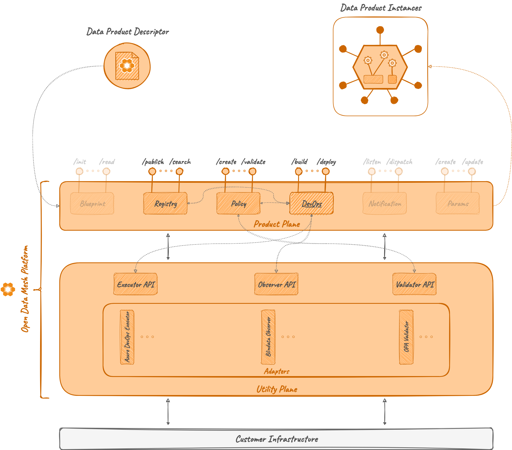

# DevOps


## Overview

The _DevOps Microservice_ is an ODM Platform module dedicated to the management of a data product lifecycle.

Specifically, it implements the logic that allows users to handle the lifecycle of a Data Product Version in terms of DevOps operation. It exposes a set of APIs to handle all the set of operations needed to promote the data product to a particular lifecycle phase (e.g., `dev`, `test`, `production`, ...).

This microservice makes use of the Utility Plane modules to interact with specific DevOps tools offered by the infrastructure for pipeline execution.


## Concepts

### Lifecycle

The data product _lifecycle_ encompasses the stages involved in creating, developing, deploying, managing, and decommissioning data products.

The descriptor of a data product is designed to have a  _lifecycleInfo_ section dedicated to the data product evolution specification. In particular, the lifecycle section contains information about _Activities_ and _Tasks_ (see their definitions below) of a Data Product Version.

### Stage
In the data product lifecycle, a _Stage_ represents each distinct phase of the data product delivery (for example: development, testing, deployment, production, ...).

### Activity
An _Activity_ is a set of one or more _Tasks_ (see their definition below) that represent a stage transition in the lifecycle of a Data Product Version.
For example, an _Activity_ could be a set of _Tasks_ in charge of deploying the Data Product Version in its `dev` stage.

In ODM, an _Activity_ is created through:

* Data Product ID
* Data Product Version
* Stage

### Task
A _Task_ is a single execution point of an _Activity_, such as a pipeline run on a DevOps tool. 

An _Activity_ without tasks cannot exists. Upon the creation of an _Activity_, a _Task_ is always created.

### Callback
A _Task_ must return a _callback_ to the DevOps server when its execution finishes in order to provide the execution results. The callback URL is automatically generated by the DevOps server and then passed to the specific _executor_ in a parameter named `callbackRef`.

The body of the _callback_ is optional: if it's not present, the DevOps server will assume that the _Task_ is in a successful state; if it is present, it must have the following format: 
```json
{
  "status": <status>,
  "errors": <errors>,
  "results": <results> 
}
```
where:

* `<status>` could be one of `PROCESSED` or `FAILED`
* `<errors>` is an optional string with the error encountered while executing the _Task_
* `<results>` is an optional JSON object with any kind of depth
* only one of `errors` and `results` must be given

The body of the _callback_ will be stored in the _Task_ results.

### Task Context
The DevOps Microservice allows combining the Data Product descriptor and a specific usage of the callback feature to enrich a Task with a _Context_. The _Context_ of a _Task_ is a recap of the status and the results of each previous Task of the same Activity and of each Task of an  eventual previous Activity. It allows a _Task_ to access results from previous ones and, if explicitly declared, use them as parameters for the execution.

A _Context_ is created every time a _Task_ execution is triggered. The context it's then forwarded to the [_Executor Adapter_](../utility-plane/executor/index.md) that will handle the execution by using the context parameters as needed. 


## How it works

### Architecture

As the majority of the ODM services, the DevOps Microservice is composed by two modules:

* **DevOps API**: a module containing abstract controllers, Java resource definitions, and a client to interact with the controller.
* **DevOps Server**: a module implementing the abstract controllers, any component useful to interact with the DB (entities, mappers, repositories, ...), and services needed  for DevOps operations.



### Relations

As previously stated, the DevOps service is not meant to be a standalone microservice. 
In order to properly operate as an orchestrator for DevOps operations, it requires:

* [Registry](registry.md) Server: to retrieve Data Product Version objects
* [Executor](../utility-plane/executor/index.md) adapters: to invoke the execution of _Tasks_ on the correct target DevOps tool

In addition, it could also have optional interactions with:

* [Policy Service](../product-plane/policy.md): to optionally validate stage transitions and _Tasks_ and _Activity_ results
* [Notification services](../utility-plane/notification/index.md): to optionally send policy evaluation events and/or stage transition events

#### Registry

The creation of an _Activity_, including its Tasks, requires a reachable instance of the __Registry Server__ to fetch the content of the _Activity_. 
The DevOps server will start even without a reachable Registry Server, but every creation will return an error.

#### Executor

The execution of an _Activity_ requires an active instance of the chosen _Executor Adapter_.  Each _Activity_ could be potentially executed on a different DevOps provider, adding multiple  adapters to the requirements.  So, the number of _Executor Adapters_ that the DevOps microservice needs to know depends on the desired user behaviour.

#### Notification

!!! warning 

    This section describes code that is still evolving.

The DevOps Microservice has a [Notification](../utility-plane/notification/index.md) system based on the Observer Design Pattern. On the application startup, every notification _listener_ listed in the property file is registered and, when an event occurs, a dispatcher sends the notification to every active listener.

The following are the events handled by the DevOps microservice:

* DATA_PRODUCT_STAGE_TRANSITION 
* DATA_PRODUCT_TASK_RESULTS
* DATA_PRODUCT_ACTIVITY_RESULTS

#### Policy

!!! warning 

    This section describes code that is still evolving.

The DevOps Service is able to interact with the [Policy](../product-plane/policy.md) Microservice to check:

* validity of a stage transition: upon an _Activity_ start future and previous stages are checked
* compliance of _Task_ results:
 * the _Task_ results are return within a _callback_
 * for example: validating a _Terraform plan_ returned in the callback before proceeding with the next _Task_ or with the closing of the _Activity_
* compliance of _Activity_ results
  * the result of an _Activity_ is the combination of the results of each of its _Task_
  * the full set of results could be evaluated
  * when an _Activity_ ends successfully, it's possible to evaluate whether the exposed services are coherent or not with the initial contract

As shown in the dedicated section, the policies can have a special tag to specify:

* the phase in which the policy must be evaluated,
* whether the evaluation result is blocking or not for that phase.

A policy configured to be blocking and evaluated with a negative result, will lead to the failure of the relative phase.


## Examples

### Lifecycle Configuration

The descriptor of a data product is designed to have a  _lifecycleInfo_ section dedicated to the data product evolution specification. In particular, the lifecycle section contains information about _Activities_ and _Tasks_ of a Data Product Version. 

To briefly describe how the _lifecycle_ section works, let's consider the following example:

```json
{
  ..., 
  "internalComponents":{
    "lifecycleInfo":{
      "dev":[
        {
          "service": {
            "$href":"azure-devops"
          }, 
          "template":{
            "specification":"spec", 
            "specificationVersion":"2.0",
            "definition":{
              "organization":"[organizationName]",
              "project":"[projectName]",
              "pipelineId":"[pipelineID]",
              "branch":"master"
            }
          },
          "configurations":{
            "params":{
              "paramOne":"Hello World"
            }
          }
        }
      ], 
      "prod":[
        {
          "service":{
            "$href":"azure-devops"
          },
          "template":{
            "specification":"spec",
            "specificationVersion":"2.0",
            "definition":{
              "organization":"[organizationName]",
              "project":"[projectName]",
              "pipelineId":"[pipelineID]",
              "branch":"master"
            }
          },
          "configurations":{
            "params":{
              "paramOne": "Value of paramOne",
              "paramTwo": "Value of paramTwo"
            }
          }
        }
      ]
    }
  }
}
```
The Data Product Version considered in the example has two _stages_: `dev` and `prod`.
Each of them is composed by a single _Task_, which make use of Azure DevOps as DevOps service. This means that in order to execute each _Task_, a specific _Executor_ called `azure-devops` must be registered on the DevOps Service startup (as shown in the section below). 

Each _Task_ has a mandatory `template` attribute that is a JSON object containing a `definition` attribute showing how to execute the _Task_. In the example, the _Tasks_ are pipelines executed on _Azure DevOps_ and the `definition` contains information to identify them. In addition to this, each _Task_ could also have a `configuration` attribute with extra information, such as parameters for the pipeline, needed for the execution.

The content of both attributes is strictly dependent from the implementation of the _Executor Adapter_ that will handle the _Tasks_. The example above shows a possible implementation to work with the [Azure DevOps Executor](../utility-plane/executor/adapters/executor-azuredevops.md).

### Registry Server Configuration

To make sure to correctly configure the interaction among them, check the presence of the following configurations in 
the property file of the active _Spring profile_ before running the service:
```yaml
odm:
  productPlane:
    registryService:
      active: true
      address: http://<hostname>:<port>
```

### Executor Adapters Configuration

To make sure to correctly configure the interaction with the Executor Adapters, use the following configuration in the property file of the active _Spring profile_ before running the microservice:
```yaml
odm:
  utilityPlane:
    executorServices:
      azure-devops:
        active: true
        address: http://<hostname>:<port>
        checkAfterCallback: false
```
In this example, only one _Executor Adapter_ (i.e., the [_Azure DevOps Executor Adapter_](../utility-plane/executor/adapters/executor-azuredevops.md)) is configured. 
It could be used for the execution of Tasks that have `azure-devops` as `service` in the lifecycle section of a Data Product descriptor. To configure more than one executor, add another block under the `executorServices` attribute.

If the specific DevOps tool exposes an API to check the status of a pipeline, this API can be called via the _Executor Adapter_ specific implementation. This behaviour can be enabled or disabled through the `checkAfterCallback` property. If this property is set to `true`, the check will be always executed.

### Notification Adapters Configuration

To make sure to correctly configure the interaction with the Notification Adapters, use the following configuration in the property file of the active _Spring profile_ before running the microservice:
```yaml
odm:
  utilityPlane:
    notificationServices:
      <notificationListenerName>:
        active: true
        address: http://<hostname>:<port>
```
To enable multiple listeners just add another listener in the properties under the `notificationServices` attribute.

### End-to-end Example

To make the all the concepts clearer, let's explain them step by step through the following example.

Consider a Data Product Version with two Stages. Each stage is associated to an Activity which have, respectively, two Tasks and one Task. 

This is the `lifecycleInfo` section of the data product descriptor:
```json
{
  ...,
  "lifecycleInfo": {
    "dev": [
      {
        "service": {
          "$href": "azure-devops" // AzureDevOps Executor Adapter required
        },
        "template": {
          "specification": "spec",
          "specificationVersion": "2.0",
          "definition": {
            // references for the AzureDevOps pipeline
          }
        },
        "configurations": {
          "stageToSkip": [],
          "params": {
            // parameters for the AzureDevOps pipeline
          }
        }
      },
      {
        "service": {
          "$href": "azure-devops"
        },
        "template": {
          "specification": "spec",
          "specificationVersion": "2.0",
          "definition": {
            // references for the AzureDevOps pipeline
          }
        },
        "configurations": {
          "stageToSkip": [],
          "params": {
            // parameters for the AzureDevOps pipeline
          }
        }
      }
    ],
    "test":[
      {
        "service":{
          "$href":"azure-devops"
        },
        "template":{
          "specification":"spec",
          "specificationVersion":"2.0",
          "definition":{
            // references for the AzureDevOps pipeline
          }
        },
        "configurations":{
          "stageToSkip": [],
          "params": {
            // parameters for the AzureDevOps pipeline
          }
        }
      }
    ]
  },
  ...
}
```

The first Activity aims to deploy the Data Product Version in the `dev` stage,  while the latter has the goal to promote the product to the `test` stage. Let's assume that inside the `dev` stage, the first Task is provisioning the infrastructure and the second one is deploying an application on that infrastructure.

When the DevOps server receives the request to execute the first Activity, it extracts all the Tasks from the Activity. Then, it is ready to sequentially forward the Task execution request to the right Executor Adapter. Before forwarding the request to the Executor Adapter, the DevOps service enriches the Task with a Context.

For the first Task of the first Activity, the Context will be:
```json
{
  "dev": {
    "status": "RUNNING",
    "finishedAt": null,
    "results": null
  }
}
```
and the `configurations` attribute of the Task will become:
```json
{
  ...,
  "configurations": {
    "params": {
      // parameters for the AzureDevOps pipeline
    },
    "context": {
      "dev": {
        "status": "RUNNING",
        "finishedAt": null,
        "results": null
      }
    }
  }
}
```

When the first Task of the first Activity finishes its execution (let's assume with a successful state), it forwards a callback to the DevOps server communicating its status and any result obtained during the execution (e.g., the IP address to access a VM in the provisioned infrastructure).

The callback body can be something similar to:
```json
{
  "status": "PROCESSED",
  "results": {
    "vm": {
      "name": "vm-dev",
      "ip": "198.168.20.120"
    }
  }
}
```

When a callback from the DevOps tool is received, it is processed and the results are stored in the database.

Now, the request for the second Task can be submitted as well. The DevOps service takes the second Task, enriches it with the Context of the first one, and forwards it to the Executor Adapter. The Context now becomes:
```json
{
  "dev": {
    "status": "RUNNING",
    "finishedAt": null,
    "results": {
      "task1": {
        "vm": {
          "name": "vm-dev",
          "ip": "198.168.20.120"
        }
      }
    }
  }
}
```
and the `configurations` attribute of the Task will become:
```json
{
  ...,
  "configurations": {
    "params": {
      // parameters for the AzureDevOps pipeline
    },
    "context": {
      "dev": {
        "status": "RUNNING",
        "finishedAt": null,
        "results": {
          "task1": {
            "vm": {
              "name": "vm-dev",
              "ip": "198.168.20.120"
            }
          }
        }
      }
    }
  }
}
```

After the second Task of the first Activity finishes its execution with a successful state, it  forwards a callback to the DevOps server communicating its status and, for example, a _Hello World_ endpoint URL of the deployed application. 
The callback body is:
```json
{
  "status": "PROCESSED",
  "results": {
    "url": "localhost:8121/helloWorld"
  }
}
```

Finally, the DevOps server receives a request to execute the second Activity of the same Data Product Version. It extracts the single Task repeating the same operations showed above. 
This time, the context and the enriched Task (only its `configurations` attribute is shown) will be: 
```json
{
  "dev": {
    "status": "PROCESSED",
    "finishedAt": "2023-11-23 14:32:00",
    "results": {
      "task1": {
        "vm": {
          "name": "vm-dev",
          "ip": "198.168.20.120"
        }
      },
      "task2": {
        "url": "localhost:8121/helloWorld"
      }
    }
  },
  "test": {
    "status": "RUNNING",
    "finishedAt": null,
    "results": null
  }
}
```
```json
{
  ...,
  "configurations": {
    "params": {
      // parameters for the AzureDevOps pipeline
    },
    "context": {
      "dev": {
        "status": "PROCESSED",
        "finishedAt": "2023-11-23 14:32:00",
        "results": {
          "task1": {
            "vm": {
              "name": "vm-dev",
              "ip": "198.168.20.120"
            }
          },
          "task2": {
            "url": "localhost:8121/helloWorld"
          }
        }
      },
      "test": {
        "status": "RUNNING",
        "finishedAt": null,
        "results": null
      }
    }
  }
}
```

In this way, each Task can potentially access any previous result in the Data Product Version DevOps lifecycle.

Considering the same example, how can the Context be used? 
Suppose that the second Task of the first Activity requires the IP of the provisioned infrastructure to deploy the application, and the Task of the second Activity needs to know the URL of the application endpoint.
Through a specific syntax, it's possible to encode directly in the Data Product descriptor a placeholder variable whose value would be retrieved from the context. The JSON descriptor will be similar to:
```json
{
  ...,
  "lifecycleInfo": {
    "dev": [
      {
        "service": {
          "$href": "azure-devops" // AzureDevOps Executor Adapter required
        },
        "template": {
          "specification": "spec",
          "specificationVersion": "2.0",
          "definition": {
            "organization":"mycustomorg",
            "project":"mycustomproject",
            "pipelineId":"2",
            "branch":"master"
          }
        },
        "configurations": {
          "stageToSkip": [],
          "params": {
            "param1": "value1",
            "param2": "value2"
          }
        }
      },
      {
        "service": {
          "$href": "azure-devops"
        },
        "template": {
          "specification": "spec",
          "specificationVersion": "2.0",
          "definition": {
            "organization":"mycustomorg",
            "project":"mycustomproject",
            "pipelineId":"3",
            "branch":"master"
          }
        },
        "configurations": {
          "stageToSkip": [],
          "params": {
            "param": "value",
            "vmIp": "${dev.results.task1.vm.ip}"
          }
        }
      }
    ],
    "test":[
      {
        "service":{
          "$href":"azure-devops"
        },
        "template":{
          "specification":"spec",
          "specificationVersion":"2.0",
          "definition":{
            "organization":"mycustomorg",
            "project":"mycustomproject",
            "pipelineId":"6",
            "branch":"master"
          }
        },
        "configurations":{
          "stageToSkip": [],
          "params": {
            "param": "value",
            "endpointURL": "${dev.results.task2.url}"
          }
        }
      }
    ]
  },
  ...
}
```

Thanks to this strategy, the [_Executor AzureDevOps_](../utility-plane/executor/adapters/executor-azuredevops.md), and, generally, every other Executor Adapter, can replace the placeholder for the variable with values from the context.

In this scenario, the Azure DevOps pipeline of the second Task of the `dev` Activity can use a `vmIp` parameter, as well as the pipeline for the Task of the `test` Activity can use an `endpointURL` parameter.


## Technologies

Other than the default Java, Maven and Spring technologies, the DevOps module does not make use of any particular technology.


## References

* GitHub repository: <a href="https://github.com/opendatamesh-initiative/odm-platform" target="_blank">odm-platform:octicons-link-external-24:</a>
* API Documentation: <a href="https://opendatamesh-initiative.github.io/odm-api-doc/doc.html" target="_blank">ODM Api Documentation:octicons-link-external-24:</a>, subitem _devops-server-redoc-static.html_ after selecting a specific version