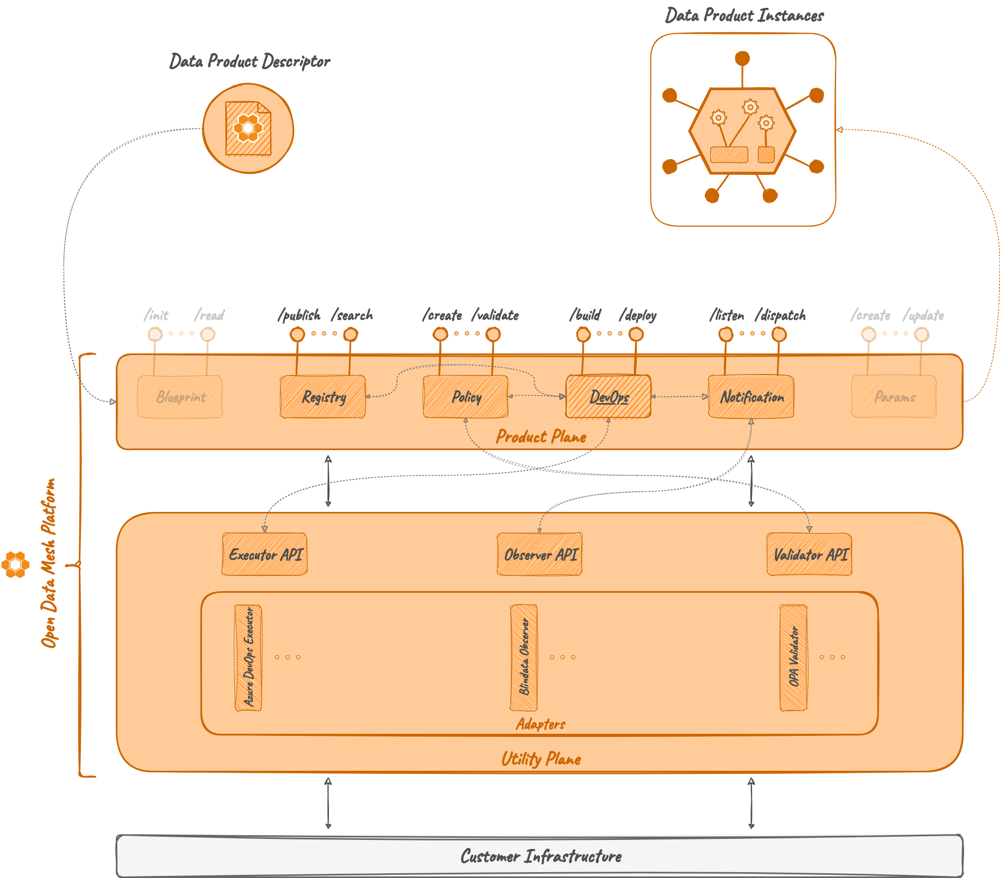

# DevOps

## Description
DevOps is a module of the Product Plane of the ODM Platform.
It's a module that strictly requires:

* one active instance of the [_Registry Server_](../../architecture/product-plane/registry.md)
* at least one active instance of an [_Executor_](../../architecture/utility-plane/executor/index.md)

It implements the logic that allows users to handle the lifecycle of a Data Product Version object in terms of DevOps operation.
It exposes APIs to create and execute _Activities_, as well as storing their results,
where each _Activity_ represents a stage transition from a previous state to the next desired one.
For example, an Activity could be a set of operations, called _Tasks_, that correctly promote the Data Product from 
a `dev` stage to a `test` stage. 

In order to define an _Activity_, the _Registry Server_ must be reachable to retrieve the Data Product Version that will 
be the subject of the activity. 
As previously said, an _Activity_ could then be composed of one or more _Tasks_, where each one is usually a _pipeline_
of a DevOps tool (e.g., Azure DevOps).
After the creation of an _Activity_, the ODM DevOps Service allows executing it, executing one by one each of its _Tasks_. 
To make the execution possible, an _Executor_ must be running and reachable, to receive the execution call and forward it 
to the DevOps tool, properly handling request and response from it.

A basic description and a how-to guide for execution is available on the module [README.md](https://github.com/opendatamesh-initiative/odm-platform/blob/main/product-plane-services/devops-server/README.md) on GitHub.

## Technologies

* Java 11
* Maven 3.8.6
* Spring 5.3.28
* Spring Boot 2.7.13

Other than the default Java, Maven and Spring technologies, the DevOps module does not make use of any particular technology.

## Concepts

### Activity
TODO

### Task
TODO

### Callback
TODO

### Lifecycle section of a Data Product Descriptor
TODO

## Architecture
As the majority of the ODM services, the Blueprint Service is composed by:

* DevOps API module: a module containing abstract controller, resource definition and a client to interact with the controller
* DevOps Server module: a module implementing the abstract controller, any other component to interact with the DB, and any service needed for DevOps operations



## Relationships
As previously stated, the DevOps service is not meant to be a standalone service. 
In order to properly operate as an orchestrator for DevOps operations, it requires:

* Registry Server: to retrieve Data Product Version objects
* Executor adapters: to invoke the execution of _Tasks_ on the correct target DevOps tool

### Registry Server
The creation of an _Activity_, including its Tasks, requires a reachable instance of the _Registry Server_ to fetch the
content of the _Activity_. 
The DevOps server will start even without a reachable Registry Server, but every creation will return an error.

To make sure to correctly configure the interaction among them, check the presence of the following configurations in 
the property file of the active _Spring profile_ before running the service:
```yaml
odm:
  productPlane:
    registryService:
      active: true
      address: http://<hostname>:<port>
```

Additional information about service configuration or configuration and execution through Docker is available on the module 
[README.md](https://github.com/opendatamesh-initiative/odm-platform/blob/main/product-plane-services/devops-server/README.md)
on GitHub.

### Executor Adapters
If the creation of an _Activity_ involves the _Registry Server_, the execution of it requires an active instance of the
right _Executor Adapter_. 
Each _Activity_ could be potentially executed on a different DevOps provider, adding multiple 
adapters to the requirements. 
So, the number of _Executor Adapters_ that the DevOps service needs to know depends on the desired behaviour of it.

To make sure to correctly configure the interaction among them,  check the presence of something similar to 
the following configurations in the property file of the active _Spring profile_ before running the service:
```yaml
odm:
  utilityPlane:
    executorServices:
      azure-devops:
        active: true
        address: http://<hostname>:<port>
        checkAfterCallback: false
```
In this example, only one _Executor Adapter_ (i.e., the [_Azure DevOps Executor Adapter_](../utility-plane/executor/adapters/executor-azuredevops.md))
is configured for usage. 
It could be used for the execution of Tasks that have `azure-devops` as `service` in the Data Product descriptor.
To configure more than one executor, add another block like the `azure-devops` one under the `executorServices` attribute.

_Executor Adapter_ could also have an API to check the status of a pipeline once the DevOps server received 
a callback from it. If a specific adapter has that ability, 
it could be enabled or disabled through the `checkAfterCallback` property.

Additional information about service configuration or configuration and execution through Docker is available on the module 
[README.md](https://github.com/opendatamesh-initiative/odm-platform/blob/main/product-plane-services/devops-server/README.md)
on GitHub.