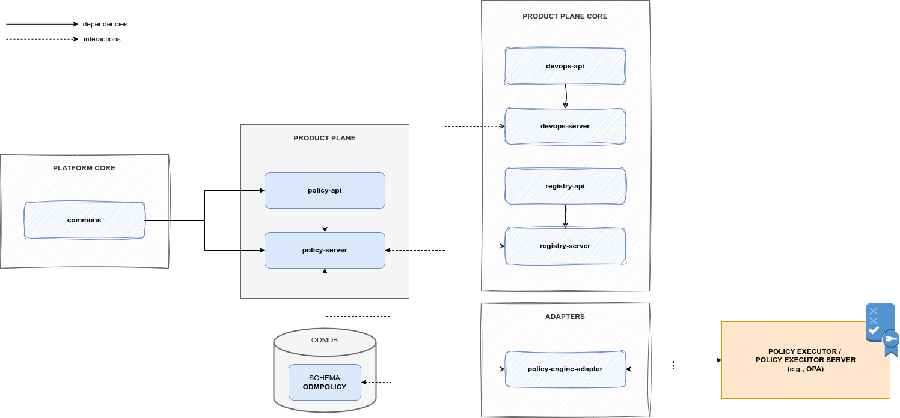

# Policy

Policy Service is the ODM Product Plane module that handles the concept of _Policy_. 
It allows creating, updating, deleting, deploying and evaluating policies.
These operations are possible both as independent operations or as a reaction to event of the platform, 
such as _Registry events_ (e.g. creation of a Data Product)
or _DevOps events_ (e.g. transition from a _dev_ stage to a _prod_ stage).

Even if it's potentially an independent module, it strictly requires at least one active 
[_Policy Engine Adapter_](../utility-plane/policy/index.md) in order to evaluate a policy.

Policy Service implements the logic to create:

* specific _Engines_, that are services with the ability to execute a policy, defined through:
  * unique name
  * URL to reach the Engine or the Adapater for the Engine
* _Policy Implementations_, that represent a Policy including:
  * the _Engine_ for the execution
  * metadata
  * eventually, the raw content of the Policy

It stores Policy objects and orchestrates their execution through the choice and the usage of the right
Engine (i.e., Engine that will be served through a _Policy Engine Adapter_).

Even if it is possible to use the Policy Service as a simple Policy store and validator, 
the default usage involves interactions with [_Registry Server_](registry.md) and/or [_DevOps Server_](devops.md).
In this scenario, a Policy could be _blocking_ or not, and the evaluation of specific sets of Policies is required
in pre-defined phases of the Platform processes. 

As an example, a set of policies, blocking and/or not blocking, could be evaluated
during the creation of a Data Product Version. If at least one blocking policy returns a negative evaluation, 
the creation process is blocked and error is returned to the user.

A basic description and a how-to guide for execution is available on the module [README.md](https://github.com/opendatamesh-initiative/odm-platform/blob/main/product-plane-services/devops-server/README.md) on GitHub.

## References

* GitHub repository: [odm-platform](https://github.com/opendatamesh-initiative/odm-platform)
* GitHub readme: [README.md](https://github.com/opendatamesh-initiative/odm-platform/blob/main/product-plane-services/policy-server/README.md)
* API Doc: [ODM Api Documentation](https://opendatamesh-initiative.github.io/odm-api-doc/index.html), section _Doc_, subitem _policy-server-redoc-static.html_ after selecting a version

## Technologies

* Java 11
* Maven 3.8.6
* Spring 5.3.28
* Spring Boot 2.7.13

Other than the default Java, Maven and Spring technologies, 
the Policy module does not make use of any particular technology.

## Concepts

### Policy Engine
A Policy Engine is an object able to directly execute policies
or to interact with specific existing policy services like [_OPA_](https://www.openpolicyagent.org/) (i.e. Open Policy Agent).

In the Policy Service, a Policy Engine is represented through a unique name and a URL to reach it.
If the Engine is a [_Policy Engine Adapter_](../utility-plane/policy/index.md), the URL is the one to reach it, 
then the adapter will know how to properly interact with the underlying policy service and answer the request.
If the Engine is directly a service able to execute a policy, it will be reached directly through the stored URL.

### Policy
A Policy in the Policy Service is the representation of the implementation of a policy.
The representation includes a unique name, useful metadata and, most important, 
the reference of the _Engine_ needed for the evaluation.

When the evaluation of one or more policy is requested, the right Engine will be used.

Another important part of a Policy is the _suite_ attribute. 
When the Policy Service is used by Registry and DevOps services, 
specific points of the processes require the evaluation of pre-defined set of policies.
Such sets are defined through the _suite_ attribute.
Possible _suite_ values are:

* DATA_PRODUCT_CREATION (Registry)
* DATA_PRODUCT_UPDATE (Registry)
* ACTIVITY_STAGE_TRANSITION (DevOps)
* TASK_EXECUTION_RESULT (DevOps)
* ACTIVITY_EXECUTION_RESULT (DevOps)

Each value represents a specific phase of ODM processes. 

As an example, consider the creation of a Data Product or a Data Product Version object; 
that is encoded by the _suite_ value DATA_PRODUCT_CREATION.
After assessing the syntactic validity of the input descriptor, 
the Registry asks the Policy Service for the evaluation of any policy with _suite_ DATA_PRODUCT_CREATION.


## Architecture
As the majority of the ODM services, the Policy Service is composed by:

* Policy API module: a module containing abstract controller, resource definition and a client to interact with the controller
* Policy Server module: a module implementing the abstract controller, any other component to interact with the DB, and any service needed for the Policy operations



## Relationships
Policy Service, as described in the introduction, could act as a standalone project,
but it's meant to interact with other ODM services, such as Registry service and DevOps services. 

Any relationship is indirect, the Policy service doesn't directly know or interact with other services,
but it replies to pre-defined requests from the ODM services.

_Registy_ interacts with it to block the creation or the update of Data Product objects 
not compliant with global policies.

_DevOps_ interacts with the Policy server to evaluate:

* whenever a stage transition is valid, 
* if a Task result is the expected one and
* if at the end of an _Activity_ the application status reflects the one described in the contract

As explained in the [Policy section](#policy), interactions are orchestrated by ODM processes 
and strictly dependent on events. 
Some phases of the processes require policy evaluations and which policy must be evaluated in which phase 
is regulated by the _suite_ attribute of the stored policies.

### Default Events
When interacting with other ODM services, Policy Service expects to react to the following events:

* DATA_PRODUCT_CREATION
* DATA_PRODUCT_UPDATE
* ACTIVITY_STAGE_TRANSITION
* TASK_EXECUTION_RESULT
* ACTIVITY_EXECUTION_RESULT

Such kind of events is encapsulated in the body of an evaluation request through the required
`PolicyEvaluationRequestResource`.

When an evaluation request occurs, the Policy Service select all the registered policies with the
`suite` attribute matching the event type and forward them to the right Policy Engine Adapter for the evaluation.
It then collects the results, aggregates them, and forwards a response to the original request.

Each event has a default input object, which will be the subject of the policy evaluations request.
The input object is obtained combining two attributes of the original request body 
(i.e., a `PolicyEvaluationRequestResource` resource), that are `currentState` and `afterState`.

This document lists an example of the input object for every event. 

!!! info
    
    Each object shown in the examples has been trimmed as it merely serves as an example of the input object


#### Registry Events
Events representing operations from the Registry Server, that are:

* DATA_PRODUCT_CREATION
* DATA_PRODUCT_UPDATE

---

##### DATA_PRODUCT_CREATION

This event represents the creation of a Data Product Version object for a Data Product without any existing version.

In this event only the `afterState` attribute is populated. 

###### Current State
An empty object, that is the state before the creation of the Data Product Version.
```json
{
  "dataProductVersion": {}
}
```

###### After State
The JSON representation of a `DataProductEventTypeResource`, that include only a Data Product Version DPDS object, 
that is the state after the creation of the Data Product Version
```json
{
  "dataProductVersion": {
    "dataProductDescriptor": "1.0.0",
    "info": {
      "fullyQualifiedName": "urn:org.opendatamesh:dataproducts:tripExecution",
      "domain": "sampleDomain",
      "name": "tripExecution",
      "version": "1.0.0",
      "displayName": "Trip Execution",
      "description": "Gestione viaggi trasporti merce",
      ...
    },
    ...
  }
}
```

###### Input Object
The composed input object that will be forwarded to the right Policy Engine Adapter.
```json
{
  "currentState": {
    "dataProductVersion": {}
  },
  "afterState": {
    "dataProductVersion": {
      "dataProductDescriptor": "1.0.0",
      "info": {
        "fullyQualifiedName": "urn:org.opendatamesh:dataproducts:tripExecution",
        "domain": "sampleDomain",
        "name": "tripExecution",
        "version": "1.0.0",
        "displayName": "Trip Execution",
        "description": "Gestione viaggi trasporti merce",
        ...
      },
      ...
    }
  }
}
```

---

##### DATA_PRODUCT_UPDATE

This event represents the update of a Data Product Version object, 
that is the creation of a Data Product Version for a Data Product with at least one already existing version.

In this event, both `currentState` and `afterState` is populated. 
In this way it will be possible to implement policy such as schema retro-compatibility, 
or any other check that involves the previous and the current version.

###### Current State
The previous version of the Data Product updated, represented as a `DataProductEventTypeResource` JSON object 
that include a `DataProductVersionDPDS`.
```json
{
  "dataProductVersion": {
    "dataProductDescriptor": "1.0.0",
    "info": {
      "fullyQualifiedName": "urn:org.opendatamesh:dataproducts:tripExecution",
      "domain": "sampleDomain",
      "name": "tripExecution",
      "version": "1.0.0",
      "displayName": "Trip Execution",
      "description": "Gestione viaggi trasporti merce",
      ...
    },
    ...
  }
}
```

###### After State
The newly created Data Product Version, represented as a `DataProductEventTypeResource` JSON object
that include a `DataProductVersionDPDS`.
```json
{
  "dataProductVersion": {
    "dataProductDescriptor": "1.0.0",
    "info": {
      "fullyQualifiedName": "urn:org.opendatamesh:dataproducts:tripExecution",
      "domain": "sampleDomain",
      "name": "tripExecution",
      "version": "2.0.0",
      "displayName": "Trip Execution",
      "description": "Gestione trasporti merce da sorgente a destinazione",
      ...
    },
    ...
  }
}
```

###### Input Object
The composed input object that will be forwarded to the right Policy Engine Adapter.
```json
{
  "currentState": {
    "dataProductVersion": {
      "dataProductDescriptor": "1.0.0",
      "info": {
        "fullyQualifiedName": "urn:org.opendatamesh:dataproducts:tripExecution",
        "domain": "sampleDomain",
        "name": "tripExecution",
        "version": "1.0.0",
        "displayName": "Trip Execution",
        "description": "Gestione viaggi trasporti merce",
        ...
      },
      ...
    }
  },
  "afterState": {
    "dataProductVersion": {
      "dataProductDescriptor": "1.0.0",
      "info": {
        "fullyQualifiedName": "urn:org.opendatamesh:dataproducts:tripExecution",
        "domain": "sampleDomain",
        "name": "tripExecution",
        "version": "2.0.0",
        "displayName": "Trip Execution",
        "description": "Gestione trasporti merce da sorgente a destinazione",
        ...
      },
      ...
    }
  }
}
```

#### DevOps Events
Events representing operations from the DevOps Server, that are:

* ACTIVITY_STAGE_TRANSITION
* TASK_EXECUTION_RESULT
* ACTIVITY_EXECUTION_RESULT

---

##### ACTIVITY_STAGE_TRANSITION

This event represents the execution request of an Activity for a specific Data Product Version.

In this event, the `currentState` could be empty, 
in the scenario of a first Activity for a specific Data Product Version,
or it could be populated with the current lifecycle stage of the Data Product Version.
The `afterState` is always populated with information about the Activity to execute.

In this way, it will be possible to evaluate conditions such as the possibility of executing the given Activity
given the current lifecycle of the Data Product Version subject of the Activity.

###### Current State
An empty `ActivityStageTransitionEventTypeResource` object, if it's the first Activity for the specific Data Product Version.
```json
{
  "lifecycle": {},
  "activity": {},
  "tasks": {}
}
```
A LifecycleResource JSON object in case of a Data Product Version with at least one previous Activity executed.
```json
{
  "lifecycle": {
    "dataProductId": "ca8802b6-bc59-3ad8-8436-fdfe79c9c512",
    "dataProductVersion": "1.0.0",
    "stage": "dev",
    "results": {
      "task1": {
        "customResult": "value1",
        "result2": {
          "subresult2_1": "value2_1",
          "subresult2_2": "value2_2"
        }
      },
      "task2": {
        ...
      },
      ...
    },
    "startedAt": "2024-03-21T12:04:11.000+00:00",
    "finishedAt": "2024-03-21T12:17:11.000+00:00"
  },
  "activity": {},
  "tasks": {}
}
```

###### After State
A composite object putting together the JSON object of the ActivityResource to execute 
and the JSON representation of the list of TaskResource included in the Activity.
```json
{
  "lifecycle": {},
  "activity": {
    "id": 2,
    "dataProductId": "ca8802b6-bc59-3ad8-8436-fdfe79c9c512",
    "dataProductVersion": "1.0.0",
    "stage": "prod",
    "status": "PLANNED",
    "results": null,
    "errors": null,
    "createdAt": "2024-03-21T12:04:11.000+00:00",
    "startedAt": null,
    "finishedAt": null
  },
  "tasks": [
    {
      "id": 6,
      "activityId": "2",
      "executorRef": "azure-devops",
      "callbackRef": "http://localhost:8002/api/v1/pp/devops/tasks/6/status?action=STOP",
      "template": "{\"organization\":\"customOrg\",\"project\":\"customProject\",\"pipelineId\":3,\"branch\":\"main\"}",
      "configurations": "{\"stagesToSkip\":[\"Test\"],\"params\":{\"paramOne\":\"value1.1\",\"paramTwo\":\"${dev.results.task1.customResult}\"}}",
      "status": "PLANNED",
      "results": null,
      "errors": null,
      "createdAt": "2024-03-21T12:04:11.000+00:00",
      "startedAt": null,
      "finishedAt": null
    },
    ...
  ]
}
```

###### Input Object
The composed input object that will be forwarded to the right Policy Engine Adapter.

In the scenario of a first Activity for a specific Data Product Version:
```json
{
  "currentState": {
    "lifecycle": {},
    "activity": {},
    "tasks": {}
  },
  "afterState": {
    "lifecycle": {},
    "activity": {
      "id": 2,
      "dataProductId": "ca8802b6-bc59-3ad8-8436-fdfe79c9c512",
      "dataProductVersion": "1.0.0",
      "stage": "prod",
      "status": "PLANNED",
      "results": null,
      "errors": null,
      "createdAt": "2024-03-21T12:04:11.000+00:00",
      "startedAt": null,
      "finishedAt": null
    },
    "tasks": [
      {
        "id": 6,
        "activityId": "2",
        "executorRef": "azure-devops",
        "callbackRef": "http://localhost:8002/api/v1/pp/devops/tasks/6/status?action=STOP",
        "template": "{\"organization\":\"customOrg\",\"project\":\"customProject\",\"pipelineId\":3,\"branch\":\"main\"}",
        "configurations": "{\"stagesToSkip\":[\"Test\"],\"params\":{\"paramOne\":\"value1.1\",\"paramTwo\":\"${dev.results.task1.customResult}\"}}",
        "status": "PLANNED",
        "results": null,
        "errors": null,
        "createdAt": "2024-03-21T12:04:11.000+00:00",
        "startedAt": null,
        "finishedAt": null
      },
      ...
    ]
  }
}
```

In the scenario of a Data Product Version with at least one previous Activity executed:

```json
{
  "currentState": {
    "lifecycle": {
      "dataProductId": "ca8802b6-bc59-3ad8-8436-fdfe79c9c512",
      "dataProductVersion": "1.0.0",
      "stage": "dev",
      "results": {
        "task1": {
          "customResult": "value1",
          "result2": {
            "subresult2_1": "value2_1",
            "subresult2_2": "value2_2"
          }
        },
        "task2": {
          ...
        },
        ...
      },
      "startedAt": "2024-03-21T12:04:11.000+00:00",
      "finishedAt": "2024-03-21T12:17:11.000+00:00"
    },
    "activity": {},
    "tasks": {}
  },
  "afterState": {
    "lifecycle": {},
    "activity": {
      "id": 2,
      "dataProductId": "ca8802b6-bc59-3ad8-8436-fdfe79c9c512",
      "dataProductVersion": "1.0.0",
      "stage": "prod",
      "status": "PLANNED",
      "results": null,
      "errors": null,
      "createdAt": "2024-03-21T12:04:11.000+00:00",
      "startedAt": null,
      "finishedAt": null
    },
    "tasks": [
      {
        "id": 6,
        "activityId": "2",
        "executorRef": "azure-devops",
        "callbackRef": "http://localhost:8002/api/v1/pp/devops/tasks/6/status?action=STOP",
        "template": "{\"organization\":\"customOrg\",\"project\":\"customProject\",\"pipelineId\":3,\"branch\":\"main\"}",
        "configurations": "{\"stagesToSkip\":[\"Test\"],\"params\":{\"paramOne\":\"value1.1\",\"paramTwo\":\"${dev.results.task1.customResult}\"}}",
        "status": "PLANNED",
        "results": null,
        "errors": null,
        "createdAt": "2024-03-21T12:04:11.000+00:00",
        "startedAt": null,
        "finishedAt": null
      },
      ...
    ]
  }
}
```

---

##### TASK_EXECUTION_RESULT

This event represents the reception of a callback from the execution of a single Task of an Activity for a specific Data Product Version.

In this event, only the `currentState` attribute will be populated with the representation of the completed Task and its results.

###### Current State
A `TaskExecutionResultEventTypeResource` JSON object that includes:

* the parent ActivityResource
* the TaskResource updated with the results from the TaskResultResource representing the body received from the callback.

Considering the following TaskResultResource:
```json
{
  "status": "PROCESSED",
  "results": {
    "customResult": "custom",
    "prova": "2"
  }
}
```
the currentState object will be:
```json
{
  "activity": {
    "id": 1,
    "dataProductId": "ca8802b6-bc59-3ad8-8436-fdfe79c9c512",
    "dataProductVersion": "1.0.0",
    "stage": "dev",
    "status": "PROCESSING",
    "results": null,
    "errors": null,
    "createdAt": "2024-03-21T12:01:11.000+00:00",
    "startedAt": "2024-03-21T12:03:19.000+00:00",
    "finishedAt": null
  },
  "task": {
    "id": 2,
    "activityId": "1",
    "executorRef": "azure-devops",
    "callbackRef": "http://localhost:8002/api/v1/pp/devops/tasks/2/status?action=STOP",
    "template": "{\"organization\":\"customOrg\",\"project\":\"customProject\",\"pipelineId\":3,\"branch\":\"main\"}",
    "configurations": "{\"params\":{\"paramOne\":\"value1\",\"paramTwo\":\"value2\"}}",
    "status": "PROCESSED",
    "results": {
      "customResult": "customValue",
      "customResultTwo": "customValueTwo"
    },
    "errors": null,
    "createdAt": "2024-03-21T12:04:00.000+00:00",
    "startedAt": "2024-03-21T12:08:55.000+00:00",
    "finishedAt": "2024-03-21T12:08:55.000+00:00"
  }
}
```

!!! info
    
    A specific example of policy evaluation could be the evaluation of a set of constraints on a terraform plan. In this scenario, the TaskResultResource will be the JSON representation of the terraform plan and the results attribute of the task will contain it.


###### After State
An empty `TaskExecutionResultEventTypeResource` object, given that there isn't any future state for the reception of a Task Result.
```json
{
  "activity": {},
  "task": {}
}
```

###### Input Object
The composed input object that will be forwarded to the right Policy Engine Adapter.
```json
{
  "currentState": {
    "activity": {
      "id": 1,
      "dataProductId": "ca8802b6-bc59-3ad8-8436-fdfe79c9c512",
      "dataProductVersion": "1.0.0",
      "stage": "dev",
      "status": "PROCESSING",
      "results": null,
      "errors": null,
      "createdAt": "2024-03-21T12:01:11.000+00:00",
      "startedAt": "2024-03-21T12:03:19.000+00:00",
      "finishedAt": null
    },
    "task": {
      "id": 2,
      "activityId": "1",
      "executorRef": "azure-devops",
      "callbackRef": "http://localhost:8002/api/v1/pp/devops/tasks/2/status?action=STOP",
      "template": "{\"organization\":\"customOrg\",\"project\":\"customProject\",\"pipelineId\":3,\"branch\":\"main\"}",
      "configurations": "{\"params\":{\"paramOne\":\"value1\",\"paramTwo\":\"value2\"}}",
      "status": "PROCESSED",
      "results": {
        "customResult": "customValue",
        "customResultTwo": "customValueTwo"
      },
      "errors": null,
      "createdAt": "2024-03-21T12:04:00.000+00:00",
      "startedAt": "2024-03-21T12:08:55.000+00:00",
      "finishedAt": "2024-03-21T12:08:55.000+00:00"
    }
  },
  "afterState": {
    "activity": {},
    "task": {}
  }
}
```

---

##### ACTIVITY_EXECUTION_RESULT

This event represents the execution of the last Task of an Activity for a specific Data Product Version.

This event has only the `currentState` attribute populated.

Once the activity is completed, it's possible to check conditions such as the coherence of the deployed services with the initial contract.

###### Current State
The JSON representation of a `ActivityResultEventTypeResource` that includes:

* the Activity
* the Data Product Version DPDS object

```json
{
  "activity": {
    "id": 2,
    "dataProductId": "ca8802b6-bc59-3ad8-8436-fdfe79c9c512",
    "dataProductVersion": "1.0.0",
    "stage": "prod",
    "status": "PROCESSED",
    "results": {
      ...
    },
    "errors": null,
    "createdAt": "2024-03-21T12:04:11.000+00:00",
    "startedAt": "2024-03-21T12:04:12.000+00:00",
    "finishedAt": "2024-03-21T12:34:46.000+00:00"
  },
  "dataProductVersion": {
    "dataProductDescriptor": "1.0.0",
    "info": {
      "fullyQualifiedName": "urn:org.opendatamesh:dataproducts:tripExecution",
      "domain": "sampleDomain",
      "name": "tripExecution",
      "version": "1.0.0",
      "displayName": "Trip Execution",
      "description": "Gestione viaggi trasporti merce",
      ...
    },
    ...
  }
}
```

###### After State
An empty `ActivityResultEventTypeResource` object, given that there isn't any future state for the end of the execution of an Activity.

```json
{
  "activity": {},
  "dataProductVersion": {}
}
```

###### Input Object
The composed input object that will be forwarded to the right Policy Engine Adapter.
```json
{
  "currentState": {
    "activity": {
      "id": 2,
      "dataProductId": "ca8802b6-bc59-3ad8-8436-fdfe79c9c512",
      "dataProductVersion": "1.0.0",
      "stage": "prod",
      "status": "PROCESSED",
      "results": {
        ...
      },
      "errors": null,
      "createdAt": "2024-03-21T12:04:11.000+00:00",
      "startedAt": "2024-03-21T12:04:12.000+00:00",
      "finishedAt": "2024-03-21T12:34:46.000+00:00"
    },
    "dataProductVersion": {
      "dataProductDescriptor": "1.0.0",
      "info": {
        "fullyQualifiedName": "urn:org.opendatamesh:dataproducts:tripExecution",
        "domain": "sampleDomain",
        "name": "tripExecution",
        "version": "1.0.0",
        "displayName": "Trip Execution",
        "description": "Gestione viaggi trasporti merce",
        ...
      },
      ...
    }
  },
  "afterState": {
    "activity": {},
    "dataProductVersion": {}
  }
}
```