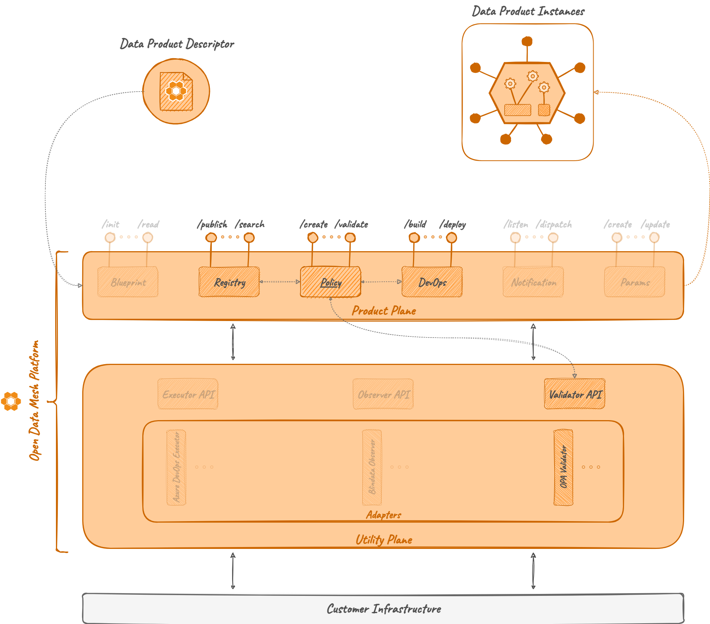

# Policy

Policy Service is the ODM Product Plane module that handles the concept of _Policy_. 
It allows creating, updating, deleting, deploying and evaluating policies.
These operations are possible both as independent operations or as a reaction to event of the platform, 
such as _Registry events_ (e.g. creation of a Data Product)
or _DevOps events_ (e.g. transition from a _dev_ stage to a _prod_ stage).

Even if it's potentially an independent module, it strictly requires at least one active 
[_Policy Engine Adapter_](../utility-plane/policy/index.md) in order to evaluate a policy.

Policy Service implements the logic to create:

* specific _Engines_, that are services with the ability to execute a policy, defined through:
  * unique name
  * URL to reach the Engine or the Adapater for the Engine
* _Policy Implementations_, that represent a Policy including:
  * the _Engine_ for the execution
  * metadata
  * eventually, the raw content of the Policy

It stores Policy objects and orchestrates their execution through the choice and the usage of the right
Engine (i.e., Engine that will be served through a _Policy Engine Adapter_).

Even if it is possible to use the Policy Service as a simple Policy store and validator, 
the default usage involves interactions with [_Registry Server_](registry.md) and/or [_DevOps Server_](devops.md).
In this scenario, a Policy could be _blocking_ or not, and the evaluation of specific sets of Policies is required
in pre-defined phases of the Platform processes. 

As an example, a set of policies, blocking and/or not blocking, could be evaluated
during the creation of a Data Product Version. If at least one blocking policy returns a negative evaluation, 
the creation process is blocked and and error is returned to the user.

A basic description and a how-to guide for execution is available on the module [README.md](https://github.com/opendatamesh-initiative/odm-platform/blob/main/product-plane-services/devops-server/README.md) on GitHub.

## References

* GitHub repository: [odm-platform-up-services-meta-blindata](https://github.com/opendatamesh-initiative/odm-platform-up-services-meta-blindata)
* GitHub readme: [README.md](https://github.com/opendatamesh-initiative/odm-platform-up-services-meta-blindata/README.md)
* API Doc: [ODM Api Documentation](https://opendatamesh-initiative.github.io/odm-api-doc/index.html), section _Doc_, item _1.0.0-DRAFT_, sub-item _policy-server-redoc-static.html_

## Technologies

* Java 11
* Maven 3.8.6
* Spring 5.3.28
* Spring Boot 2.7.13

Other than the default Java, Maven and Spring technologies, 
the Policy module does not make use of any particular technology.

## Concepts

### Policy Engine
A Policy Engine is an object able to directly execute policies
or to interact with specific existing policy services like [_OPA_](https://www.openpolicyagent.org/) (i.e. Open Policy Agent).

In the Policy Service, a Policy Engine is represented through a unique name and a URL to reach it.
If the Engine is a [_Policy Engine Adapter_](../utility-plane/policy/index.md), the URL is the one to reach it, 
then the adapter will know how to properly interact with the underlying policy service and answer the request.
If the Engine is directly a service able to execute a policy, it will be reached directly through the stored URL.

### Policy
A Policy in the Policy Service is the representation of the implementation of a policy.
The representation includes a unique name, useful metadata and, most important, 
the reference of the _Engine_ needed for the evaluation.

When the evaluation of one or more policy is requested, the right  Engine will be used.

Another important part of a Policy is the _suite_ attribute. 
When the Policy Service is used by Registry and DevOps services, 
specific points of the processes require the evaluation of pre-defined set of policies.
Such sets are defined through the _suite_ attribute.
Possible _suite_ values are:

* DATA_PRODUCT_CREATION (Registry)
* DATA_PRODUCT_UPDATE (Registry)
* ACTIVITY_STAGE_TRANSITION (DevOps)
* TASK_EXECUTOR_INITIAL_CALL (DevOps)
* TASK_EXECUTOR_FINAL_CALL (DevOps)

Each value represents a specific phase of ODM processes. 

As an example, consider the creation of a Data Product or a Data Product Version object; 
that is encoded by the _suite_ value DATA_PRODUCT_CREATION.
After assessing the syntactic validity of the input descriptor, 
the Registry asks the Policy Service for the evaluation of any policy with _suite_ DATA_PRODUCT_CREATION.

## Architecture
As the majority of the ODM services, the Policy Service is composed by:

* Policy API module: a module containing abstract controller, resource definition and a client to interact with the controller
* Policy Server module: a module implementing the abstract controller, any other component to interact with the DB, and any service needed for the Policy operations

## Relationships
Policy Service, as described in the introduction, could act as a standalone project,
but it's meant to interact with other ODM services, such as Registry service and DevOps services. 

Any relationship is indirect, the Policy service doesn't directly know or interact with other services,
but it replies to pre-defined requests from the ODM services.

_Registy_ interacts with it to block the creation or the update of Data Product objects 
not compliant with global policies.

_DevOps_ interacts with the Policy server to evaluate:

* whenever a stage transition is valid, 
* if a Task result is the expected one and
* if at the end of an _Activity_ the application status reflects the one described in the contract

As explained in the [Policy section](#policy), interactions are orchestrated by ODM processes 
and strictly dependent on events. 
Some phases of the processes require policy evaluations and which policy must be evaluated in which phase 
is regulated by the _suite_ attribute of the stored policies.