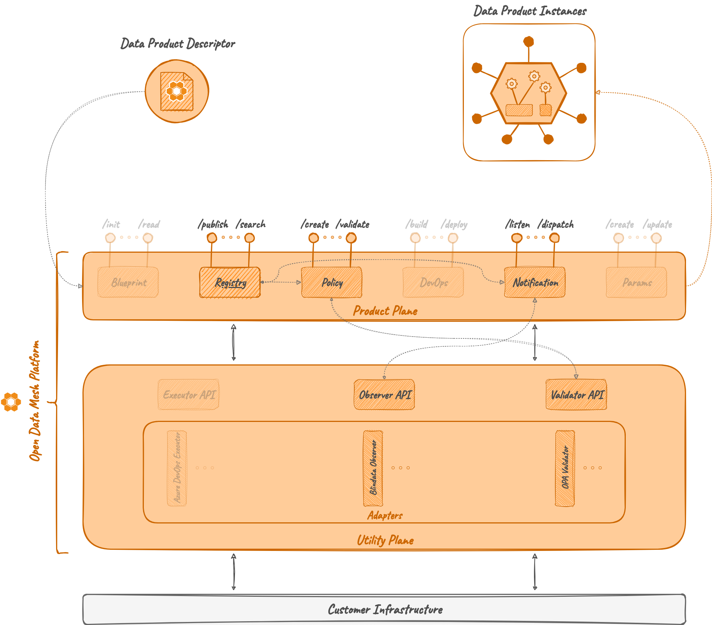

# Registry

## Overview

The *Registry Microservice* is the ODM Platform main module that allows to create, edit, 
retrieve and delete Data Products and Data Product Versions within the mesh. 
This microservice provides functionalities to create data products using the 
[Data Product descriptor](../../concepts/data-product-descriptor.md) and to manage them via specific APIs.

In addition to the basic features to store and manage Data Product and Data Product Version objects, 
it offers syntactic and semantic validation to ensure the correctness of every data product object.

Optionally, it is configurable to enable the interaction with other ODM Platform microservices, 
such as those for policy computation or events notification. 

## Concepts

### Data Product

At this point, it should be clear what a data product is. If it's not, you can deep dive on the 
<a href="https://dpds.opendatamesh.org/concepts/data-product/" target="_blank">DPDS site:octicons-link-external-24:</a>.

### Data Product Version

A data product version refers to a specific release of a data product within an organization's data platform. 
Just like softwares have versions, data products also undergo iterations and updates over time. 
Data product versions help in managing changes, tracking improvements, 
and ensuring compatibility with downstream systems and consumers. 
Each version of a data product may introduce new features, enhancements, bug fixes, 
or modifications to the underlying data schema or structure.

## How it works

### Architecture

As the majority of the ODM services, the Registry Microservice is composed of two modules:

* **Registry API**: a module containing abstract controllers, Java resource definitions, and a client to interact with the controller.
* **Registry Server**: a module implementing the abstract controllers, any component useful to interact with the DB (entities, mappers, repositories, ...), and services needed for the Registry operations.



### Relations

Registry is the ODM Platform Product Plane main module, 
and it can act both as a standalone microservice or interact with different ODM features, 
such as [Policy](../product-plane/policy.md) or [Observer](../utility-plane/observer/index.md) microservices.

The optional interaction with other ODM microservices, configurable through a properties file, enables to:

* ensure that each object is compliant with a set of policies, potentially blocking the creation and/or update of a non-compliant object;
* notify a list of registered observers on many _events_ occured on data product objects, such as _creation_, _update_ or _deletion_.

#### Policy

!!! warning 

    This section describes code that is still evolving.

The Registry Microservice is able to interact with the [Policy](../product-plane/policy.md) Microservice 
to check the compliance of a Data Product or of a Data Product Version both at creation and update time.

As shown in the dedicated section, the Policy Microservice stores policies that have a special tag to specify the phase 
in which the policy must be evaluated and whether the evaluation result is blocking or not for the phase. 
A blocking policy with a negative evaluation will lead to the failure of the relative data product phase.

As an example, consider the existence of a few policies that check if before the creation of a Data Product Version 
all the names of the components are compliant with a specific naming convention. 
If the interaction with the Policy Microservice is active, 
the creation of a Data Product Version with one or more components' name not compliant with the naming convention 
will fail returning an error from the Policy Microservice.

#### Observer

The Registry Microservice has an [Observer](../utility-plane/observer/index.md) system based on the Observer Design Pattern. 
On the application startup, every notification _listener_ listed in the configurations is registered 
and, when an event occurs, a dispatcher sends the notification to every active listener.

The following are the events handled by the Registry:

* DATA_PRODUCT_CREATED 
* DATA_PRODUCT_UPDATED 
* DATA_PRODUCT_DELETED
* DATA_PRODUCT_VERSION_CREATED 
* DATA_PRODUCT_VERSION_DELETED

## Examples

Each interaction between the Registry Microservice and other ODM services is enabled or disabled through properties file
inside the Java application, as shown by the following snippet:

```yaml
odm:
  productPlane:
    policyService:
      active: false
      address: http://localhost:8005
  utilityPlane:
    notificationServices:
      blindata:
        active: true
        address: http://localhost:9002
```
In this example, the interaction with the Policy Microservice is disabled using the attribute `active: false`, 
while there is only one active notification system named `blindata` reachable at `http://localhost:9002`.

To register a new notification _listener_, edit the active Spring profile property file as follows: 

```yaml
odm:
  utilityPlane:
    notificationServices:
      blindata:
        active: false
        address: http://localhost:9002
      <newNotificationListenerName>:
        active: <activeFlag>
        address: http://<hostname>:<port>
```
As an example, consider adding a new _listener_ called `customListener` reachable at `http://locahost:9003` to the active listeners; 
the section of the property file shown before will be: 
```yaml
odm:
  utilityPlane:
    notificationServices:
      blindata:
        active: false
        address: http://localhost:9002
      customListener:
        active: true
        address: http://localhost:9003
```

Additional information about service configuration and execution via Docker are available on 
<a href="https://github.com/opendatamesh-initiative/odm-platform/blob/main/README.md" target="_blank">Github:octicons-link-external-24:</a>.

## Technologies

Other than the default Java, Maven and Spring technologies, the Registry module does not make use of any particular technology.

## References

* GitHub repository: <a href="https://github.com/opendatamesh-initiative/odm-platform" target="_blank">odm-platform:octicons-link-external-24:</a>
* API Documentation: <a href="https://opendatamesh-initiative.github.io/odm-api-doc/doc.html" target="_blank">ODM Api Documentation:octicons-link-external-24:</a>, subitem _registry-server-redoc-static.html_ after selecting a specific version