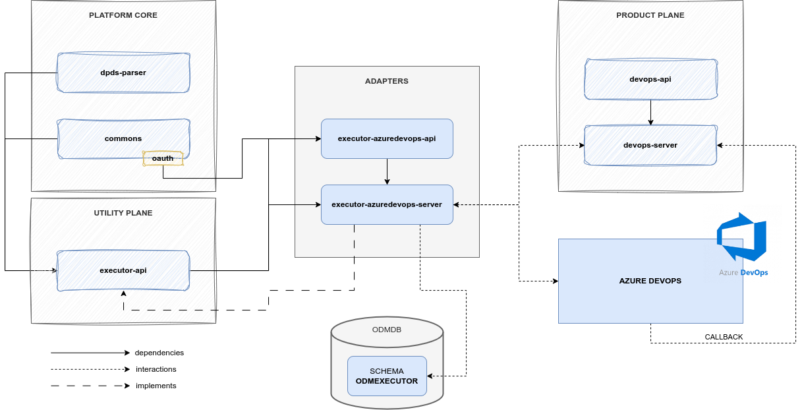

# Executor Azure DevOps

## Overview

The Executor Azure DevOps is an [_Executor Adapter_](../index.md) that acts as a proxy between the [_DevOps Server_](../../../product-plane/devops.md) and <a href="https://azure.microsoft.com/en-us/products/devops/" target="_blank">Azure DevOps:octicons-link-external-24:</a>.

Its purpose is to receive all the _Tasks_ to execute, process them, and forward the execution request to Azure DevOps. In addition to this:

* it keeps track of the mapping between the ODM _Task_ and the _Azure DevOps pipeline_ that has been triggered,
* it exposes an endpoint to check the pipeline status,
* it updates the mapping properties with status information.

In order to properly interact with Azure DevOps, it needs to handle the _authorization_ mechanism; for this reason, the Executor Azure DevOps microservice uses OAuth 2.0 to get the authorization credentials needed for Azure services.

## How it works

### Architecture
As the majority of the ODM services, the Executor AzureDevOps Service is composed by:

* Azure DevOps API module: a module containing resource definition and a client to interact with Azure DevOps
    * differently from the _Product Plane_ services, it does not expose any abstract controller
* Blueprint Server module: a module implementing the abstract controller, any other component to interact with the DB, and any service needed for the logic
    * the abstract controller and commons part are not retrieved from the API module, but from the [_Executor_](../index.md) module of the Utility Plane

The _Executor AzureDevOps_ is an adapter, an implementation of Executor,
so it only overrides parts specific to Azure DevOps, including communication with it and handling resources.

### Relations
Executor AzureDevOps it's not meant to be a standalone service,
but it has the ability to be used as an independent module.
It exposes reachable APIs, and it includes any information needed to communicate with Azure.

Even if it's possible, the only actions that don't involve any other ODM services are access to the adapter Database 
to retrieve information about Task executions.

Its default usage always includes interactions with:
* DevOps Service, to receive Task to be executed and to, eventually, check the status of the pipeline once the Task returns a callback to the DevOps server
* Azure DevOps, to request pipeline executions or information about a specific run of a pipeline

### Tools

#### OAuth 2.0

OAuth 2.0 is the _authorization_ protocol used for interactions with Azure DevOps. It adds all the necessary authorization information to any request forwarded to the DevOps provider through an _Access Token_. It uses a client credential flow to interact with the Microsoft Entra identity provider to get the _Access Token_. 

Upon start-up, the Executor DevOps must be configured through the _property files_ with OAuth parameters like:

* Token URI (i.e., the identity provider URI to get the authorization token)
* Client ID
* Client Secret
* Scope

## Examples

### Azure DevOps Task configuration

Every Executor Azure DevOps task involves an interaction between an ODM Task (configuration of a single step in the data product lifecycle) and an Azure DevOps pipeline (execution of the configured step on the real infrastructure).
Any information required to identify the right pipeline is encoded in the input _Task_ itself, as detailed in the [DevOps Microservice](../../../product-plane/devops.md) documentation page, specifically in the `lifecycle` attribute of the `internalComponents` attribute of the Data Product descriptor.

After the _Task_ creation, the adapter for AzureDevOps requires the _Task_ object to have a `template` attribute, containing:
  
* `organization`
* `project` (i.e., project ID)
* `pipelineId`
* `branch`

and a `configurations` attribute, containing:

* `stagesToSkip`: a List with the name of stages of the desired pipeline to skip
* `params`: a Map, a set of _key-value_ pairs representing the parameters required from the pipeline in order to be executed

## Technologies

In addition to the technologies already mentioned on the main architecture page, this module makes use of the following:

* <a href="https://oauth.net/2/" target="_blank">OAuth 2.0:octicons-link-external-24:</a>

## References

* GitHub repository: <a href="https://github.com/opendatamesh-initiative/odm-platform-up-services-executor-azuredevops" target="_blank">odm-platform-up-services-executor-azuredevops:octicons-link-external-24:</a>
* API Documentation: <a href="https://opendatamesh-initiative.github.io/odm-api-doc/doc.html" target="_blank">ODM Api Documentation:octicons-link-external-24:</a>, subitem _executor-azuredevops-redoc-static.html_ after selecting a specific version