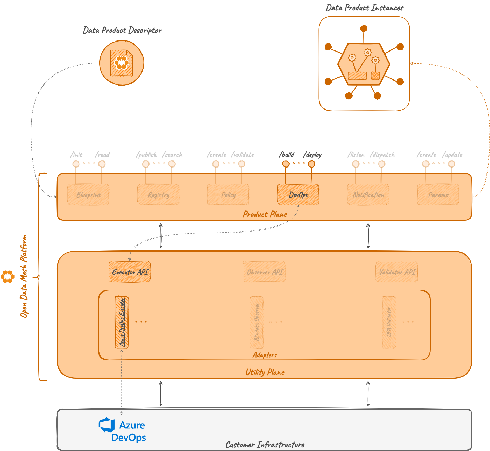

# Executor Azure DevOps

The Executor Azure DevOps is an [_Executor Adapter_](../index.md) that acts as a proxy between the
[_DevOps Server_](../../../product-plane/devops.md) and Azure DevOps.

Its main task is to receive _Task_ to execute, process them and forward the processed request to Azure DevOps.
In addition to this, it also keeps track of the mapping between the _Task_ and the requested
_Azure DevOps pipeline_, exposes and endpoint to check the pipeline status 
and update the mapping properties with status information.

In order to properly interact with Azure DevOps, it needs to handle _authorization_; for this reason, 
the Executor AzureDevOps module uses OAuth 2.0 requiring configuration of credentials before the service execution.

A basic description and a how-to guide for execution is available on the module [README.md](https://github.com/opendatamesh-initiative/odm-platform-up-services-executor-azuredevops/README.md) on GitHub.

## References

* GitHub repository: [odm-platform](https://github.com/opendatamesh-initiative/odm-platform-up-services-executor-azuredevops)
* GitHub readme: [README.md](https://github.com/opendatamesh-initiative/odm-platform-up-services-executor-azuredevops/README.md)
* API Doc: [ODM Api Documentation](https://opendatamesh-initiative.github.io/odm-api-doc/index.html), section _Doc_, subitem _executor-azuredevops-redoc-static.html_ after selecting a version

## Technologies

* Java 11
* Maven 3.8.6
* Spring 5.3.28
* Spring Boot 2.7.13
* [OAuth 2.0](https://oauth.net/2/)

### OAuth2
[OAuth 2.0](https://oauth.net/2/) is the _authorization_ protocol used for interactions with Azure DevOps.
It makes sure to add authorization information to any request forwarded to the DevOps provider through an _Access Token_.

On start-up, the Executor DevOps must be configured through the _property files_ with OAuth parameters like:

* Token URI
* Client ID
* Client Secret
* Scope

Detailed information on how to create an _Azure DevOps Service Principal_ and configure the adapter is available on the 
[README.md](https://github.com/opendatamesh-initiative/odm-platform-up-services-executor-azuredevops/README.md) on GitHub.

## Concepts

### Azure DevOps pipeline
Every Executor AzureDevOps task involves interactions with an ODM Task and an Azure DevOps pipeline.
Any information required to identify the right pipeline is encoded in the input _Task_ itself, 
as detailed in the [DevOps Service documentation page](../../../product-plane/devops.md), 
specifically in the `lifecycle` attribute of the `internalComponents` attribute of the Data Product descriptor.

After the _Task_ creation, the adapter for AzureDevOps requires the _Task_ object to have:

* `template` attribute, containing:
  * `organization`
  * `project` (i.e., project ID)
  * `pipelineId`
  * `branch`
* `configurations` attribute, containing:
  * `stagesToSkip`: a List with the name of stages of the desired pipeline to skip
  * `params`: a Map, a set of _key-value_ pairs representing the parameters required from the pipeline in order to be executed

## Architecture
As the majority of the ODM services, the Executor AzureDevOps Service is composed by:

* Azure DevOps API module: a module containing resource definition and a client to interact with Azure DevOps
  * differently from the _Product Plane_ services, it does not expose any abstract controller
* Blueprint Server module: a module implementing the abstract controller, any other component to interact with the DB, and any service needed for the logic
  * the abstract controller and commons part are not retrieved from the API module, but from the [_Executor_](../index.md) module of the Utility Plane

The _Executor AzureDevOps_ is an adapter, an implementation of Executor,
so it only overrides parts specific to Azure DevOps, including communication with it and handling resources.

## Relationships
Executor AzureDevOps it's not meant to be a standalone service,
but it has the ability to be used as an independent module.
It exposes reachable APIs, and it includes any information needed to communicate with Azure.

Even if it's possible, the only actions that don't involve any other ODM services are access to the adapter Database 
to retrieve information about Task executions.

Its default usage always includes interactions with:
* DevOps Service, to receive Task to be executed and to, eventually, check the status of the pipeline once the Task returns a callback to the DevOps server
* Azure DevOps, to request pipeline executions or information about a specific run of a pipeline