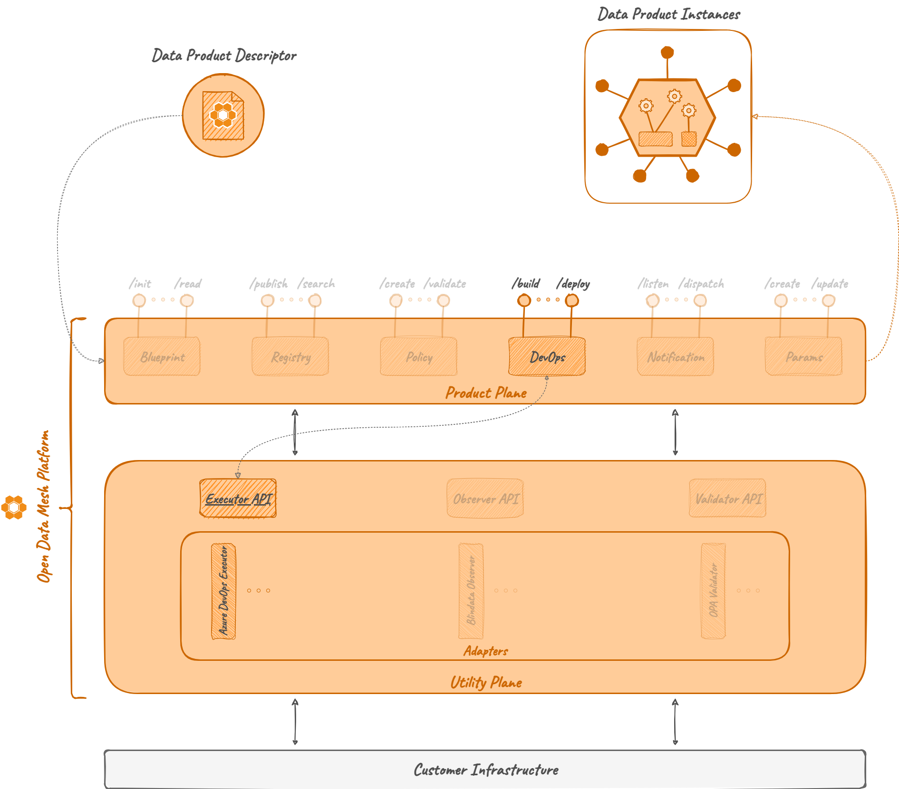

# Executor

## Overview

An *Executor* is a microservice that acts as a proxy between the [DevOps Microservice](../../product-plane/devops.md)
and a specific DevOps tool (e.g., Azure DevOps).

In the Utility Plane of the ODM Platform there is an Executor module, called `executor-api` that, like any other module in the Utility Plane, exposes an Interface to implement a specific executor. Any implementation of `executor-api` is called _Executor Adapter_.

## How it works

### Architecture

Differently from the other ODM Services, the Executor module contains only the following:

* **Executor API**: a module containing abstract controllers, Java resource definitions, and a client to interact with the controller.

A default implementation of the **Executor Server** module does not exist.

### Relations
An Executor in the Utility Plane is a generalization of the common parts that any Executor Adapter (i.e., implementation of Executor) must have. It doesn't have direct relations with any other ODM services, but each Executor Adapter will implement its abstract Controller.

Then, an Executor Adapter interacts in a passive way (i.e., it answers to API calls) with the [_DevOps Service_](../../product-plane/devops.md).

<!--
The DevOps Service knows how to interact with a specific Adapter thanks to the Executor `ExecutorClient`. The Executor module in the ODM Utility Plane has indeed a client that handles communication with the abstract controller, and each adapter directly implements the abstract controller.
-->

## Technologies

Other than the default Java, Maven and Spring technologies, the Executor module does not make use of any particular technology.