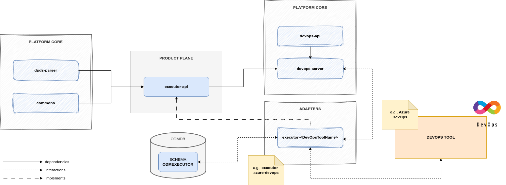

# Executor

## Description

An Executor is the service that acts as a proxy between the [DevOps Service](../../product-plane/devops.md)
and a specific DevOps tool (e.g., Azure DevOps).

In the Utility Plane of the ODM Platform there is an Executor module, called `executor-api` that, 
like any module in the Utility Plane, exposes an Interface to implement Executor.

Any implementation of `executor-api` is an _Executor Adapter_ and, actually, there is a single
adapter already developed, that is [_Executor Azure DevOps_](adapters/executor-azuredevops.md).

## Technologies
* Java 11
* Maven 3.8.6
* Spring 5.3.28
* Spring Boot 2.7.13

Other than the default Java, Maven and Spring technologies,
the Executor module does not make use of any particular technology.

## Architecture
Differently from the other ODM Services, the Executor module is a single Executor API module, 
that is a module containing abstract controller, resource definition and a client to interact with the controller.

A default implementation of the _Executor Server_ module does not exist.

## Relationships
Executor in Utility Plane is a generalization of the common parts that any
Executor Adapter (i.e., implementation of Executor) must have. 
It doesn't have any direct relationship with any other ODM service, 
but each Executor Adapter will implement its abstract Controller.

Then, an Executor Adapter interacts in a passive way (i.e., it answers to API calls) with the 
[_DevOps Service_](../../product-plane/devops.md).

The DevOps Service knows how to interact with a specific Adapter thanks to the Executor
`ExecutorClient`. The Executor module in the ODM Utility Plane has indeed a client that handles communication with 
the abstract controller, and each adapter directly implements the abstract controller.