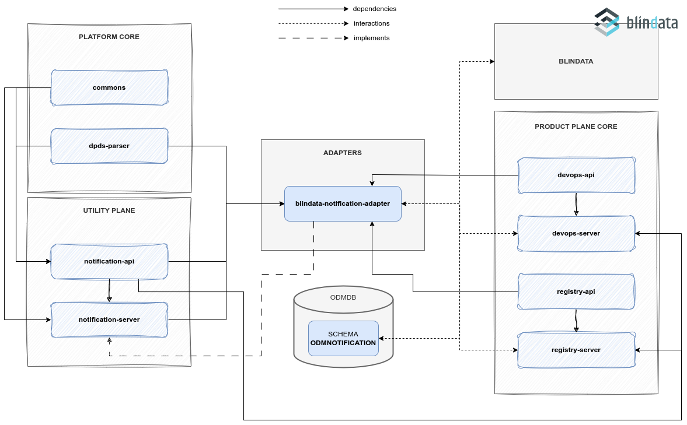

# Blindata Notification

## Description

Blindata Notification Service is a [_Notification Adapter_](../index.md), 
so an implementation of Notification of the Utility Plane, 
that acts as a Notification handler for [Blindata](https://blindata.io/).

Blindata is a SAAS platform that leverages Data Governance and Compliance to empower Data Management projects.

The main task of the adapter is receiving and handling _notifications_ from other ODM services, such as the 
[_Registry Server_](../../../product-plane/registry.md) and the [_DevOps Server_](../../../product-plane/devops.md).
After the reception of a notification, it extracts the _event_ and, depending on the nature of the event, interacts with
Blindata to create, update or remove objects.

As an example, consider the event DATA_PRODUCT_CREATION. 
Once the _Registry Server_ send a notification encapsulating 
an occurrence of such _event_ to any active listener, Blindata Notification Adapter receives it. 
It then processes the event and forwards the request for the creation of the Data Product Object on the Blindata system.

A basic description and a how-to guide for execution is available on the module [README.md](https://github.com/opendatamesh-initiative/odm-platform-up-services-meta-blindata/README.md) on GitHub.

## References

* GitHub repository: [odm-platform-up-services-meta-blindata](https://github.com/opendatamesh-initiative/odm-platform-up-services-meta-blindata)
* GitHub readme: [README.md](https://github.com/opendatamesh-initiative/odm-platform-up-services-meta-blindata/README.md)
* API Doc: [ODM Api Documentation](https://opendatamesh-initiative.github.io/odm-api-doc/index.html), section _Doc_, subitem _notification-service-blindata-redoc-static.html_ after selecting a version

## Technologies

* Java 11
* Maven 3.8.6
* Spring 5.3.28
* Spring Boot 2.7.13

Other than the default Java, Maven and Spring technologies, 
the Blindata Notification Adapter module does not make use of any particular technology.

## Architecture
The adapter has a single module, called `meta-service-blindata`, that:

* implement and/or extend the base features of a Notification adapter from the [_Notification Server module of the Utility Plane_](../index.md)
* define specific classes to interact with Blindata
  * authentication and authorization
  * services to interact with objects on Blindata 

## Relationships
Blindata Executor Adapter it's not meant to be a standalone service,
even if it has the ability to be used as an independent module. 
It contains all the required logic to interact with Blindata, but reacting on Notification reception makes it useless 
without other ODM services.

Its default usage always includes interactions with:
* Registry Service, to receive notification about registry operation on Data Product, such as creation, update, deletion, ...
* DevOps Service, to receive notification about the lifecycle of Data Product objects
* Blindata, to create, update or delete the objects representing Data Product and Data Product Version