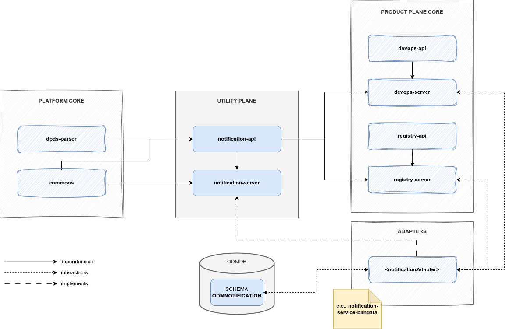

# Notification

## Description

A Notification service receives notifications and reacts to the event contained in the notification.

In the Utility Plane of the ODM Platform, there is a Notification module that, 
like any module in the Utility Plane, exposes an Interface to implement Notification services.

Any implementation of it is a _Notification Adapter_ and, actually, there is a single
adapter already developed, that is the [_Blindata Notification Adapter_](adapters/blindata.md).

## Technologies
* Java 11
* Maven 3.8.6
* Spring 5.3.28
* Spring Boot 2.7.13

Other than the default Java, Maven and Spring technologies,
the Notification module does not make use of any particular technology.

## Architecture
As the majority of the ODM services, the Blueprint Service is composed by:

* Notification API module: a module containing abstract controller, resource definition and a client to interact with the controller.
* Notification Server: a basic server eventually implementing common parts between each possible Notification Adapter

Similar to the structure of the modules in the Product Plane, the Notification Server implements
the abstract controller and other common parts such as entities, repository, exceptions, configs, ...
The difference is that it doesn't have a main class, and it isn't directly executable, leaving to the 
specific adapter the task of overriding specific behaviours and defining a runnable application.

## Relationships
Notification in Utility Plane is a generalization of the common parts that any
Notification Adapter (i.e., implementation of Notification) must have. 
It doesn't have any direct relationship with any other ODM service, 
but each Notification Adapter will implement its abstract Controller.

Then, a Notification Adapter interacts in a passive way (i.e., receives API calls) with ODM services such as 
[_DevOps Service_](../../product-plane/devops.md) or [_Registry Server_](../../product-plane/registry.md).

The ODM services know how to interact with a specific Adapter thanks to the Notification
`NotificationClient`. The Notification module in the ODM Utility Plane has indeed a client that handles communication with 
the abstract controller, and each adapter directly implements the abstract controller.