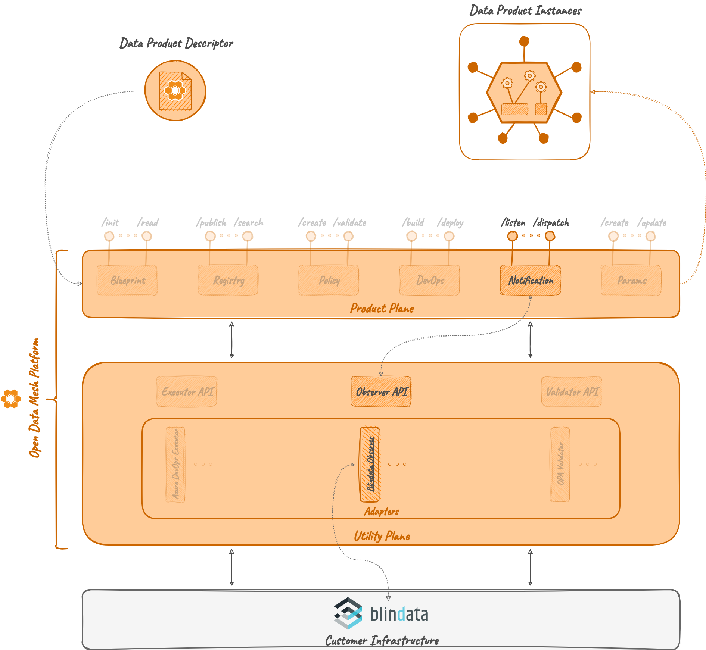

# Blindata Observer

## Overview

The _Blindata Observer Microservice_ is an [_Observer Adapter_](../index.md),
(i.e. an implementation of the Observer service of the Utility Plane),
that acts as a notification handler for <a href="https://blindata.io/"
target="_blank">Blindata:octicons-link-external-24:</a>.
Blindata is a SaaS platform that leverages Data Governance and Compliance to empower Data Management projects.

The main task of the adapter is receiving and handling notifications from other ODM services, such as the [_Registry Server_](../../../product-plane/registry.md) and the [_DevOps Server_](../../../product-plane/devops.md).
After the reception of a notification, it extracts the _event_ and, depending on the nature of the event, the microservice interacts with Blindata to create, update or remove objects.

As an example, consider the DATA_PRODUCT_CREATION event. Once the _Registry Server_ has sent a notification encapsulating such _event_ to any active listener, the Blindata Observer Adapter is able to receive it. Then, it processes the event forwarding the request for the creation of the Data Product Object on the Blindata system in order to be mapped in the governance tool.

## How it works

### Architecture
The adapter has a single module, called `meta-service-blindata`, that:

* implement and/or extend the base features of an Observer adapter from the [_Observer Server module of the Utility Plane_](../index.md)
* define specific classes to interact with Blindata
  * authentication and authorization
  * services to interact with objects on Blindata 

### Relations

Blindata Executor Adapter it's not meant to be a standalone service,
even if it has the ability to be used as an independent module. 
It contains all the required logic to interact with Blindata, but reacting to notification reception makes it useless 
without other ODM services.

Its default usage always includes interactions with:

* Registry Service, to receive notification about registry operation on Data Product, such as creation, update, deletion, ...
* DevOps Service, to receive notification about the lifecycle of Data Product objects
* Blindata, to create, update or delete the objects representing Data Product and Data Product Version

## Technologies

Other than the default Java, Maven and Spring technologies,
the Blindata Observer Adapter does not make use of any particular technology.

## References

* GitHub repository: <a href="https://github.com/opendatamesh-initiative/odm-platform-up-services-meta-blindata" target="_blank">odm-platform-up-services-meta-blindata:octicons-link-external-24:</a>
* API Documentation: [Observer Blindata Server API Documentation](../../../../api-doc/index.md)