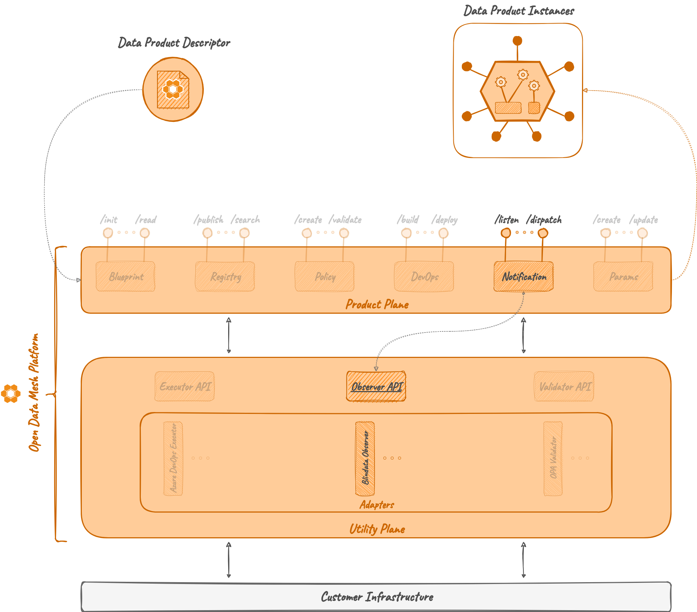

# Observer

## Overview

The *Observer* is a microservice that receives notifications and reacts to the event contained in the notification.

On the Utility Plane of the ODM Platform, the Observer module, 
like any module in the Utility Plane, exposes an interface to implement a specific notification service. Any implementation of it is called _Observer Adapter_.

## How it works

### Architecture

As the majority of the ODM services, the Observer Microservice is composed of two modules:

* **Observer API**: a module containing abstract controllers, Java resource definitions, and a client to interact with the controller.
* **Observer Server**: a basic server eventually implementing common parts between each possible Observer Adapter.

The difference between the other modules is that it doesn't have a main class:
it isn't directly executable the task of overriding specific behaviors
and defining a runnable application is left to the implemented Adapter.

### Relations

As previously said, the _Observer_ module in the Utility Plane is a generalization of the common parts that any Observer Adapter (i.e., implementation of the Observer) must have. The module doesn't have any direct relations with any other ODM service, but each Observer Adapter needs to implement its abstract controller.

Then, an Observer Adapter interacts in a passive way (i.e., receives API calls) with ODM services such as [_DevOps Service_](../../product-plane/devops.md) or [_Registry Server_](../../product-plane/registry.md).

## Technologies

Other than the default Java, Maven and Spring technologies, the Observer module does not make use of any particular technology.