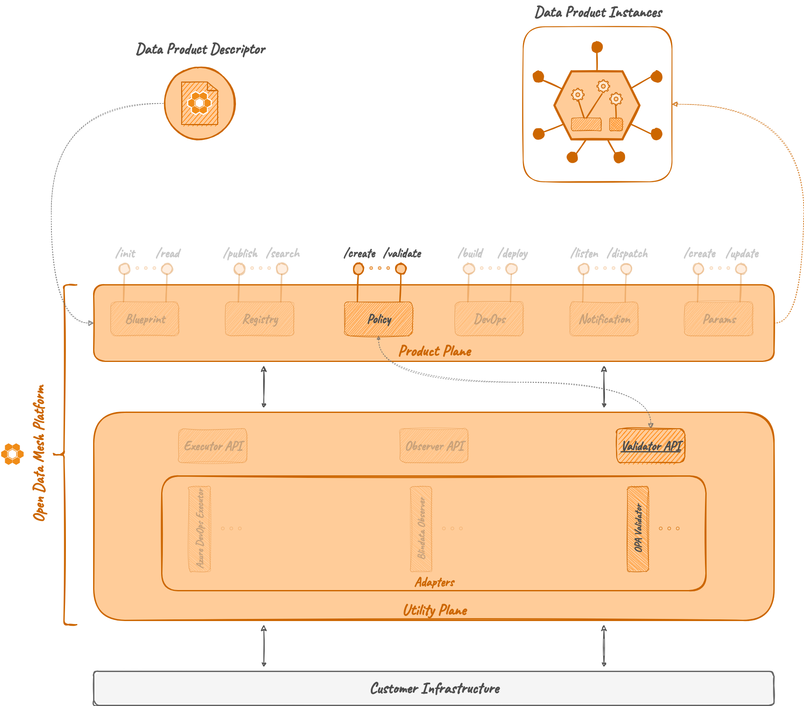

# Policy Engine

## Overview 

A Policy Engine is a microservice that answers to _policy evaluation requests_ 
received from the [_Policy Service_](../../product-plane/policy.md).

In ODM context, Engine refers to any tool capable of receiving queries requesting the evaluation of specific policies,
assessing them, and responding accordingly. 
This encompasses microservice acting as proxy to existing policy engines,
like OPA (Open Policy Agent), as well as Lambda Functions, or custom solutions.

An example of a Policy Engine is the [Policy Engine OPA](adapters/opa.md).

## How it works

### Architecture

Similar to other services within the Utility Plane,
the Policy Engine module isn't designed as a directly executable project.
Instead, it provides an interface for implementing an Adapter,
which serves as a specialized implementation of the Policy Engine.

The Policy Engine consists of a single module, named **Policy Engine API**,
containing abstract controllers, Java resource definitions, and a client to interact with the controller.

A default implementation of the *Policy Engine Server* module does not exist and any adapter must implement it.

### Relations

#### Policy Service

A Policy Engine is a microservice designed to complement the [Policy Service](../../product-plane/policy.md).
Even if it could act as a standalone service to evaluate policies, 
it's meant to act as the executor of the evaluation requests received by the Policy microservice.

Whenever a Policy Engine is ready to be included in the ODM ecosystem, 
it will simply need to be registered with the Policy microservice. 
This will enable the addition of policies intended for it and their evaluation in standard ODM processes.

Any registered Policy in the Policy server must contain the reference to a registered Policy Engine
in order to be evaluated.

#### Product Plane services

Excluding the Policy microservice, a Policy Engine doesn't directly interact with any other ODM service.
Nonetheless, whenever a Product Plane microservice makes a policy evaluation request to the Policy microservice,
the latter will use one or more Policy Engine Adapters to fulfill the request.

## Technologies

Other than the default Java, Maven and Spring technologies,
the Policy Engine module does not make use of any particular technology.