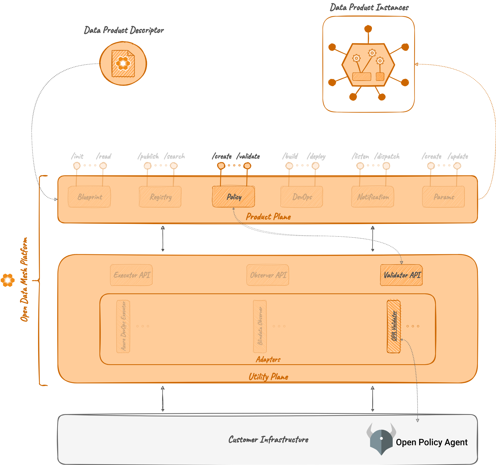

# Validator OPA

## Overview

Validator OPA is a [_Validator Adapter_](../index.md) that acts as a _proxy_
between the [_Policy Server_](../../../product-plane/policy.md) and an instance of an OPA (<a href="https://www.openpolicyagent.org/" target="_blank">Open Policy Agent:octicons-link-external-24:</a>) server.

The main responsibility of the Validator OPA is
to manage requests for policy evaluations based on designated inputs.
It accomplishes this process by receiving requests, pre-processing them, forwarding them to the OPA server, processing the results obtained from OPA, and returning them to the caller.

<!--
--non più vera come parte
Moreover,
the Validator OPA oversees the deployment of policies onto the OPA server
and ensures synchronization with policies stored in the Policy Server,
particularly those earmarked for handling by the Validator OPA.
-->

## Concepts

### OPA Policy & Rego

An OPA Policy is a rule, or a set of rules, written in <a href="https://www.openpolicyagent.org/docs/latest/policy-language/" target="_blank">Rego:octicons-link-external-24:</a>, a declarative policy language.
These rules define conditions or constraints on input data to make decisions or enforce policies.
OPA policies typically operate on structured data, such as JSON objects, 
and are evaluated against input data to determine whether certain actions are allowed or denied.

In traditional uses of OPA, three distinct objects are contemplated: *input*, *policy*, and *data*.

- *Input* refers to the information or context against which policies are evaluated;
- *Policy* defines the rules or logic governing decision-making;
- *Data* encompasses the information to be evaluated or manipulated by policies.

However, in the context of ODM, the focus is simplified to *policy* and *input* only.
Each policy will be evaluated only on the given JSON input.

Let's explain what an OPA Policy in the ODM context with an example.
Consider the following JSON Object representing a Data Product:
```json
{
  "dataProductDescriptor": "1.0.0", 
  "info": {
    "fullyQualifiedName": "urn:org.opendatamesh:dataproducts:tripExecution", 
    "domain": "logistic", 
    "name": "tripExecution", 
    "version": "1.0.0", 
    "displayName": "Trip Execution", 
    "description": "Logistic trip scheduler",
    ...
  }
}
```

Suppose that a policy that checks the `fullyQualifiedName` has to be executed 
each time a Data Product object creation is request to ensure that it starts with `urn`.
The corresponding Rego rule could be:
```rego
package dataproduct

default allow := false
default warning := false

allow := true {
    startswith(input.info.fullyQualifiedName, "urn")
}

warning := true {
    startswith(input.info.fullyQualifiedName, "URN")
}
```

When forwarding the object to the Validator OPA, it should be encapsulated inside an `input` object, like this:

```json
{
  "input": {
    "dataProductDescriptor": "1.0.0", 
    "info": {
      "fullyQualifiedName": "urn:org.opendatamesh:dataproducts:tripExecution", 
      "domain": "logistic", 
      "name": "tripExecution", 
      "version": "1.0.0", 
      "displayName": "Trip Execution", 
      "description": "Logistic trip scheduler",
      ...
    }
  }
}
```

The OPA server will respond with the following object: 
```json
{
  "decision_id": "9bc38b6d-49ad-4955-8ad0-c46c59e6234b",
  "result": {
    "allow": true,
    "warning": false
  }
}
```

## How it works

### Architecture

The Validator OPA comprises a single module, named **Validator OPA Server**, 
which houses Java classes that implement the REST controllers of the [Validator module](../index.md), 
Java services to manage requests, and a client for interacting with a reachable OPA Server.

Differently from other ODM microservices, Validator OPA is a stateless component.
It doesn't rely on a Database, and it doesn't have any kind of state, storage or cache. 
Every time the Validator OPA receives an evaluation request, it acts with a *fire and forget* mechanism, 
including both the policy and the subject of the policy evaluation in the request for the OPA Server.
Once the evaluation is done, it does not save any result, but simply returns it to the caller.



### Relations

#### OPA Server
For proper functionality, the Validator OPA microservice strictly requires the presence of a reachable OPA Server.

In the default setup, a dockerized version of the OPA Server is employed
(<a href="https://hub.docker.com/layers/openpolicyagent/opa/latest-rootless/images/sha256-b8d2ca87f0241531433d106473bbe3661b7c9be735c447daefa164f2c3942b8d?context=explore" target="_blank">OPA - rootless:octicons-link-external-24:</a>).

This interaction is configured via property files, as shown below:
```yaml
opa:
  url:
    policies: http://localhost:8181/v1/policies
    data: http://localhost:8181/v1/data
```

Additional information about service configuration and execution via Docker are available on 
<a href="https://github.com/opendatamesh-initiative/odm-platform-adapter-validator-opa/blob/main/README.md" target="_blank">GitHub:octicons-link-external-24:</a>.

#### Policy Service and Product Plane services

Within the ODM ecosystem, the Validator OPA it's designed to work together with the [Policy Service](../../../product-plane/policy.md), 
acting as a direct extension of it.
Its main task is to receive requests from the Policy Service and return the evaluation to be used in a Data Product 
lifecycle to assess whether a specific operation is allowed or not given the available information.

When operating withing the ecosystem, input objects are determined by Product Plane services
(i.e., Registry and DevOps) and forwarded to the Policy Service.
The Policy Service collaborates with the Validator OPA, and any other available Validator Adapter, 
to evaluate the request and return the answer to the Product Plane services.
Any available Validator Adapter must be stored on the Policy Server as a specific _Policy Engine_ in order to be used.

Back to the example shown before,
the same object assessed through the same Policy will have a slightly different format as shown as follows.

Let's consider the event of a DATA_PRODUCT_CREATION 
(check the [Policy](../../../product-plane/policy.md) section for further detail about events).
When the creation request is received, the Registry microservice requests the Policy Service to evaluate any
global policy that has DATA_PRODUCT_CREATION as trigger.
For the request, they compose and send the following JSON object:
```json
{
  "currentState": {
    "dataProductVersion": {}
  }, 
  "afterState": {
    "dataProductVersion": {
      "dataProductDescriptor": "1.0.0", 
      "info": {
        "fullyQualifiedName": "urn:org.opendatamesh:dataproducts:tripExecution", 
        "domain": "logistic", 
        "name": "tripExecution", 
        "version": "1.0.0", 
        "displayName": "Trip Execution", 
        "description": "Logistic trip scheduler", 
        ...
      }, 
      ...
    }
  }
}
```

When the Validator OPA receives it, it wraps it into an _input_ object as required from the OPA server, 
obtaining the following object:
```json
{
  "input": {
    "currentState": {
      "dataProductVersion": {}
    }, 
    "afterState": {
      "dataProductVersion": {
        "dataProductDescriptor": "1.0.0", 
        "info": {
          "fullyQualifiedName": "urn:org.opendatamesh:dataproducts:tripExecution", 
          "domain": "logistic", 
          "name": "tripExecution", 
          "version": "1.0.0", 
          "displayName": "Trip Execution", 
          "description": "Logistic trip scheduler", 
          ...
        }, 
        ...
      }
    }
  }
}
```

The Policy must be registered in the Policy Server before the creation request for a Data Product in order to be evaluated, 
and the Policy raw content itself will be slightly different, as shown below:
```rego
package dataproduct

default allow := false
default warning := false

allow := true {
    startswith(input.afterState.dataProductVersion.info.fullyQualifiedName, "urn")
}

warning := true {
    startswith(input.afterState.dataProductVersion.info.fullyQualifiedName, "URN")
}
```

Once the assessment request reaches the Validator OPA, it is processed
and the evaluation result is returned to the Policy Service, which then sends it back to the Registry service.

The Validator OPA operates in a *fire and forget* manner.
It temporarily saves the Policy raw content on the OPA Server, requests the evaluation on the given input object, 
collects the results, process them and returns them to the Policy Service.
Once the evaluation is done, it will remove the policy from the OPA server.

The object returned to the Policy Service will be similar to:
```json
{
  "policyEvaluationId": 1, 
  "evaluationResult": true, 
  "outputObject": {
    "allow": true, 
    "decision_id": "9bc38b6d-49ad-4955-8ad0-c46c59e6234b",
    "result": {
      "allow": true,
      "warning": false
    }
  }
}
```

The Policy service collects the evaluation results of several policies and returns a Boolean as an answer to the Registry.
The Registry then decides whether to proceed or not with the Data Product creation depending on that result.

!!! info

    It's important to observe that the Validator OPA tries to extract the `allow` attribute from the OPA server response in order to summarize the evaluation with a single Boolean value. Should such an attribute be missing in the Policy raw content, the result extraction will fail and an error will be returned.

## Technologies

In addition to the classic Java, Maven and Spring technologies, the Validator OPA requires an instance of a dockerized rootless OPA Server:

* <a href="https://hub.docker.com/layers/openpolicyagent/opa/latest-rootless/images/sha256-b8d2ca87f0241531433d106473bbe3661b7c9be735c447daefa164f2c3942b8d?context=explore" target="_blank">OPA - rootless:octicons-link-external-24:</a>


## References

* GitHub repository: <a href="https://github.com/opendatamesh-initiative/odm-platform-adapter-validator-opa" target="_blank">odm-platform-adapter-validator-opa:octicons-link-external-24:</a>
* API Documentation: [Validator OPA Server API Documentation](../../../../api-doc/index.md)